// Attributes
:walkthrough: Connecting applications across clouds with Red Hat Service Interconnect
:title: Lab 1 - {walkthrough}
:user-password: {aws-password}
:standard-fail-text: Verify that you followed all the steps. If you continue to have issues, contact a workshop assistant.
:aws-namespace: aws
:azure-namespace: azure
:frontend-namespace: {user-username}-patient-front
:backend-namespace: {user-username}-patient-back
:rhosak: Red Hat OpenShift Streams for Apache Kafka
:rhoas: Red Hat OpenShift Application Services
:cloud-console: https://console.redhat.com
:codeready-project: FleurDeLune

// URLs
:openshift-streams-url: https://console.redhat.com/beta/application-services/streams/kafkas
:next-lab-url: https://tutorial-web-app-webapp.{openshift-app-host}/tutorial/dayinthelife-streaming.git-labs-02-/
:codeready-url: https://devspaces.{openshift-app-host}/
:openshift-console: http://console-openshift-console.{openshift-app-host}/

[id='service-interconnect']
= Connect your services across different environments with Red Hat Service Interconnect

In this lab you discover how to build a service network to connect disparate services across different environments using Red Hat Service Interconnect.

[time=2]
[id="Red Hat Service Interconnect"]
== What is Red Hat Service Interconnect?
Red Hat Service Interconnect enables application and service connectivity across different environments through layer 7 addressing and routing. Using a simple command line interface, interconnections are created in a matter of minutes, avoiding extensive networking planning, and overhead. All interconnections between environments use mutual TLS(mTLS) to keep your organization’s infrastructure and data protected. Red Hat Service Interconnect is based on the open source Skupper project.

Click *Next* to proceed

[time=2]
[id="MediCorp Intro"]
== Modernizing MediCorps Legacy Patient Portal

Let us delve into the world of MediCorp, a healthcare organization offering a comprehensive portal for both doctors and patients. This portal facilitates various tasks for patients, including bill payments and appointment checks.

Presently, the patient portal is a monolithic application, which has been causing significant collaboration challenges between the front-end and back-end teams. Furthermore, it struggles to maintain efficiency and scalability during peak hours, resulting in sluggish performance and increased expenses.

In response, MediCorp has made the strategic decision to revamp their application, transitioning it into a set of microservices. These microservices will be distributed across different environments, enhancing scalability and overall performance.

Outlined below are the key challenges and questions that arose during this transformation process:

**Seamless Transition**: The modernization process is not an instantaneous change, requiring time and careful implementation. However, it's imperative that our existing application continues to function smoothly during this transition period.

**Integration of Old and New**: The integration of the "old" and the new microservices presents its own set of complexities. What happens when certain components cannot be migrated to containers and must remain in the current datacenter?

**Hybrid Cloud Possibilities**: Exploring the potential of a hybrid cloud approach with multiple service providers adds another layer of consideration to the modernization journey.

Join us in this lab as we take you through MediCorp's transformational journey. Discover how they harnessed the power of Red Hat Service Interconnect as a pivotal component of their modernization strategy, effectively tackling the challenges mentioned above and more.

Click *Next* to proceed

[type=taskResource]
.OpenShift Links
****
* link:{openshift-host}/topology/ns/{aws-namespace}[AWS Developer Console, window="_blank"]
* link:{azure-console}/topology/ns/{azure-namespace}[Azure Developer Console, window="_blank"]
****

[type=taskResource]
.RHEL Login
****
* `ssh lab-user@{rhel-hostname}`
****

[type=taskResource]
.Common Credentials
****
* *username:* `{user-username}`
* *password:* `{aws-password}`
****

[time=10]
[id="creating-connections"]
== Scenario 1 - Connecting the frontend deployed on OpenShift in AWS to the database and payment processor deployed in the data centre. 

Addressing the biggest issue first, MediCorp separated the Frontend from the Payment Processor Backend, allowing for more flexibility, independent deployment and scalability.
Given the tight coupling between JSF and the backend, MediCorp decided to re-implement the frontend as a lightweight Python application. All application components are still running in RHEL VMs in the data center. 

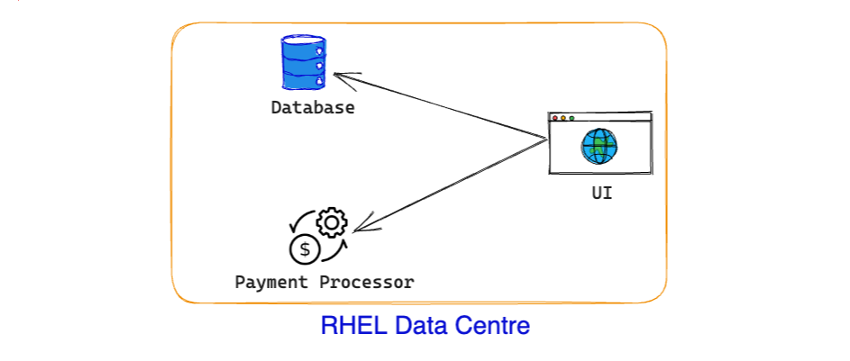

To leverage scalability and resilience for the frontend, MediCorp wants to move the Frontend to OpenShift on AWS, while the payment processor and database remain in the data center, mainly because there are regulatory requirements that require data processing or storage to happen on-prem or in specifically certified data centres. Below is the desired state and architecture that we will try to achieve in this scenario.

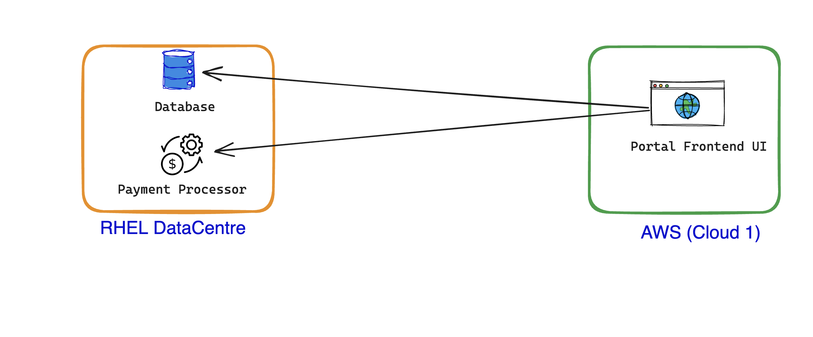

The following steps will showcase how you can connect the frontend to services(database and payment-processor) in the datacentre using Red Hat Service Interconnect. Note that none of these services are exposed to the public internet

=== Deployment overview: AWS cluster
. Open the console of the OpenShift cluster on AWS link:{openshift-host}/topology/ns/aws[AWS Developer Console, window="_blank"]
+
*username:* `{user-username}`
+
*password:* `{aws-password}`

. Double check to make sure you are in the aws namespace and expect to see frontend (called patient-portal-frontend) deployed. 
+
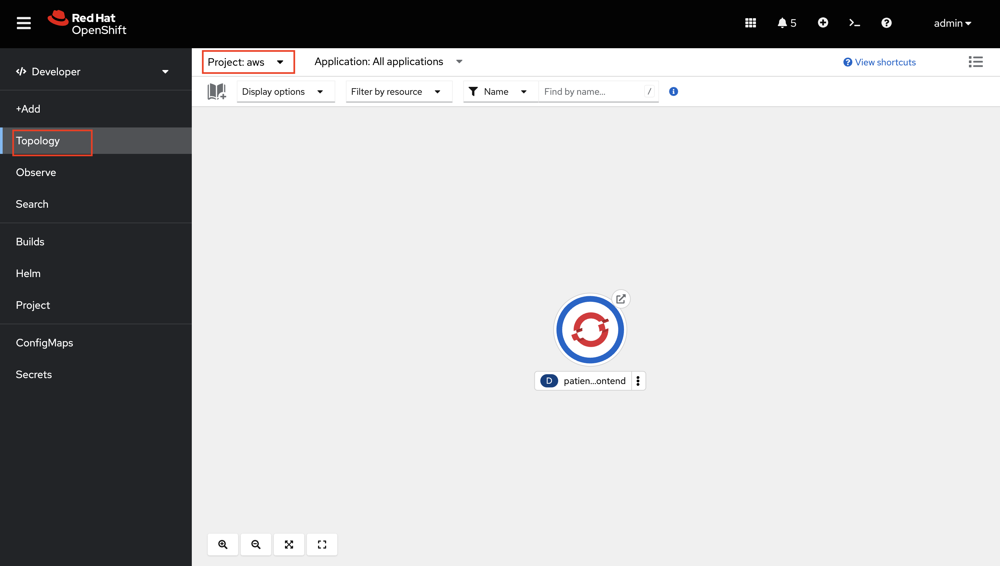

. You can check the state of the application by clicking on the route icon next to the frontend deployment as shown below.
+
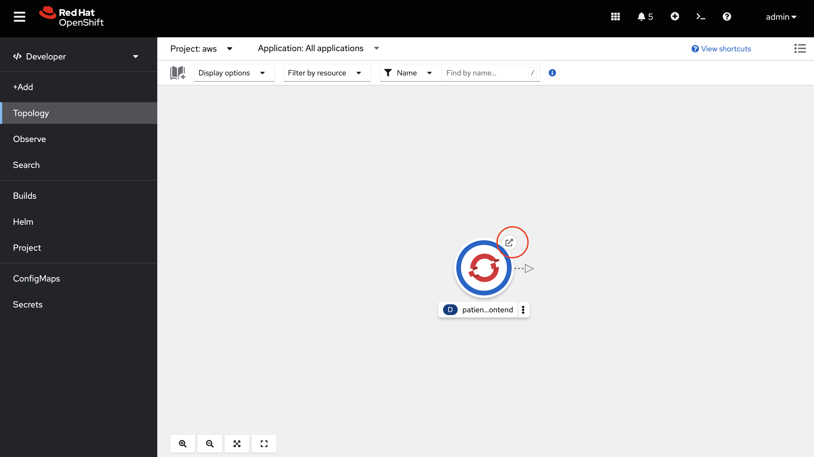

. This opens a new browser tab pointing to the home page of the Patient portal application. You should be able to see the front end of the patient portal without any patient names or doctor names as we have not established the connection with the database and payment-processor deployed in the RHEL virtual machine.
+
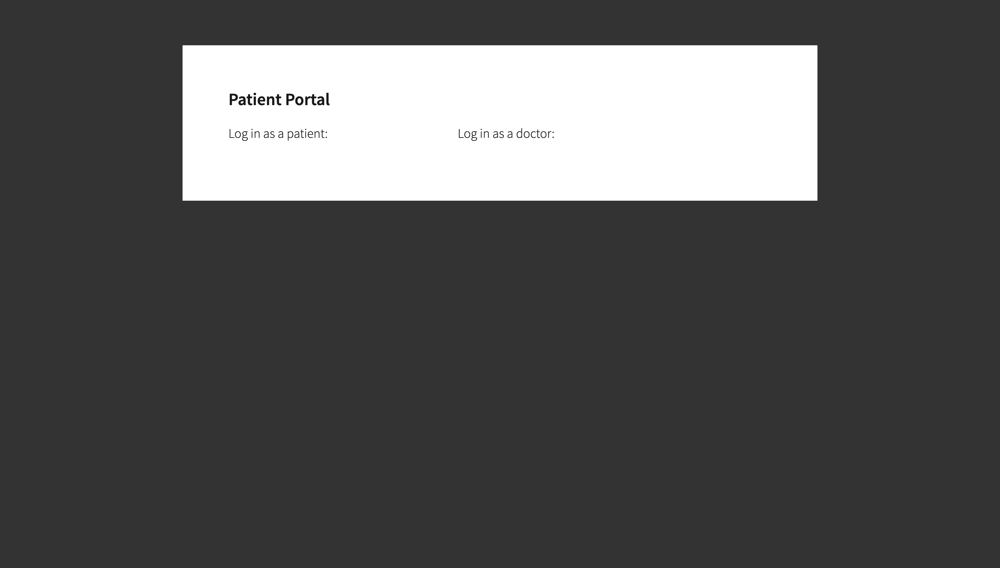

=== Deployment overview: RHEL Datacentre
. Open the terminal on your local machine and login to the RHEL datacentre
+
[source,bash,subs="attributes+"]
----
ssh lab-user@{rhel-hostname}
----
+
.Output
----
The authenticity of host 'bastion.gqnbg-2.sandbox518.opentlc.com (3.130.48.14)' can't be established.
ED25519 key fingerprint is SHA256:pYM2sFBYn/rijF9/87rNYbnRyeFRm4EkeQejpGhVQow.
This key is not known by any other names
Are you sure you want to continue connecting (yes/no/[fingerprint])?
----

. Type **yes** and enter the below password
+
[source,bash,subs="attributes+"]
----
{aws-password}
----

. You should now be logged in as lab-user in the RHEL datacentre. The database and payment-processor are already deployed on the RHEL datacentre using podman. Run the below command in your RHEL datacentre terminal to confirm the that the database and payment-processor as running in the datacentre
+
[source,bash,role=copy]
----
podman ps
----
+
.Output
----
CONTAINER ID  IMAGE                                                                 COMMAND         CREATED      STATUS          PORTS                   NAMES
c54976092427  quay.io/redhatintegration/patient-portal-payment-processor:devnation                  2 hours ago  Up 2 hours ago  0.0.0.0:8080->8080/tcp  portal-payments
07fea4fd2671  quay.io/redhatintegration/patient-portal-database:devnation           run-postgresql  2 hours ago  Up 2 hours ago  0.0.0.0:5432->5432/tcp  portal-database
----

=== Connecting the frontend deployed on OpenShift in AWS to the database and payment processor deployed in the data centre

Building a Service network between the two environments OpenShift and RHEL datacentre (more precisely between namespace of the OpenShift cluster and the services running on the datcentre) takes several steps:

. Install Service Interconnect router in both environments.

. Create a connection token in the openshift cluster.

. Use the token on the datacentre to create a link between the namespaces of openshift cluster and the services running in the datacentre.

. Expose services of one environment on the other. In this case, you will expose the  database and payment-processor on the datacentre, so that the frontend can connect to it as if they were locally deployed.

=== Initialize Red Hat Service Interconnect in the AWS cluster

The easiest way to initialize Red Hat Service Interconnect is through the skupper CLI (Skupper is the name of the open-source upstream project of Red Hat Service Interconnect). In this lab, the skupper cli is available through the OpenShift Command Line terminal, so that you don’t have to install it.

. Open the browser window pointing to the OpenShift Console of the AWS OpenShift cluster. Click on the openshift command line terminal on the top menu to open a terminal window.
+
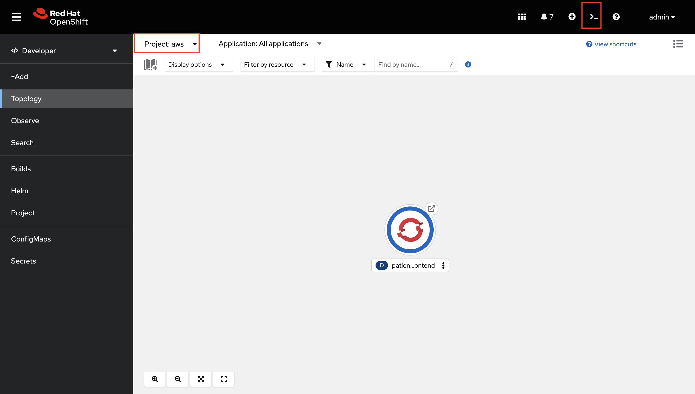

. The terminal should take two to three minutes to start up. Please be patient. Once done you should see something like this
+
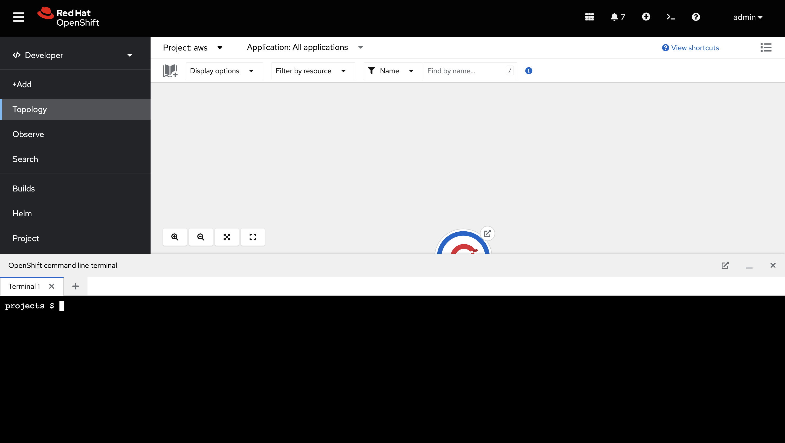

. Make sure the terminal is logged into the aws project
+
[source,bash,role=copy]
----
oc project aws
----
+
.Output
----
Now using project "aws" on server "https://172.30.0.1:443"
----

. Initialize the Service Interconnect Router by issuing the below command in the aws terminal. This should install the Service Interconnect resources in the aws namespace
+
[source,bash,role=copy]
----
skupper init --enable-console --enable-flow-collector --console-auth unsecured
----

=== Initialize Red Hat Service Interconnect in the RHEL Datacentre

Go to the terminal on your local machine where you are logged in to the RHEL datacenter. The skupper cli is also available through the RHEL datacentre terminal that you have connected. 

. Switch the skupper cli podman site mode as we will be using podman to run our skupper containers
+
[source,bash,role=copy]
----
export SKUPPER_PLATFORM=podman
----

. Confirm the same the running the below command
+
[source,bash,role=copy]
----
skupper switch
----
+
.Output
----
podman
----

. Initialize the Service Interconnect Router by issuing the below command in the RHEL datacentre terminal. 
+
[source,bash,role=copy]
----
skupper init --ingress none
----
+
.Output
----
Skupper is now installed for user 'lab-user'.  Use 'skupper status' to get more information.
----

. To see the status of the skupper network
+
[source,bash,role=copy]
----
skupper status
----
+
.Output
----
Skupper is enabled for "lab-user" with site name "bastion.example.com-lab-user" in interior mode. It is not connected to any other sites. It has no exposed services.
----

This confirms that we have not yet established the connection between the sites.

=== Create a link between the namespace on OpenShift cluster and the RHEL datacenter

To create a link between the environments, you create a token on one of the environments, and then use the token to create the link on the other.

. Navigate to the browser tab pointing to the OpenShift Web terminal on the *AWS cluster* 
+

.. **NOTE:** If you are logged out of the terminal for any reason. Click on the *Reconnect to terminal* button and and issue the `oc project aws` command to log back into the aws namespace
+
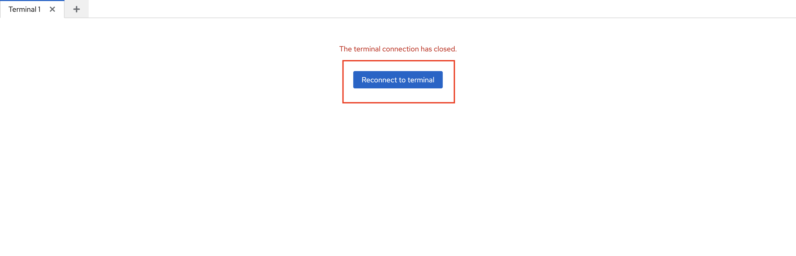

. Issue the following command
+
[source,bash,role=copy]
----
skupper token create secret_aws_vm.token
----
+
.Output
----
Token written to secret_aws_vm.token
----

. Display the token using the below command and copy it in a notepad or any text editor of your choice
+
[source,bash,role=copy]
----
cat secret_aws_vm.token
----
+
.Output
----
apiVersion: v1
data:
  ca.crt: LS0tLS1CRUdJTiBDRVJUSUZJQ0FURS0tLS0tCk1JSURMRENDQWhTZ0F3SUJBZ0lRU3RqbXd4Z2dOVWtkZnhOa1RManYxakFOQmdrcWhraUc5dzBCQVFzRkFEQWEKTVJnd0ZnWURWUVFERXc5emEzVndjR1Z5TFhOcGRHVXRZMkV3SGhjTk1qTXdPREV5TURnek16UXdXaGNOTWpndwpPREV3TURnek16UXdXakFhTVJnd0ZnWURWUVFERXc5emEzVndjR1Z5TFhOcGRHVXRZMkV3Z2dFaU1BMEdDU3FHClNJYjNEUUVCQVFVQUE0SUJEd0F3Z2dFS0FvSUJBUUM1ZktmWHlEeEg5Q0lHNUdpbU5Ob29heGl4UGIwWkNyMVUKM2J1c1lMQm5HZmZ3MEZQMEVPeUsrTVQyWEptOXdiVkNNY2tQOFp6UjFKRFZoeWpBK3AxRDlWQjRCeHpHYkVGQwp2aXhJOFcvUWdMRk85L1Q3RnN4czNUMmprTExTSVBlRDA2ZVJvQm9oMnpwNzZRV3JMVVdwZlJTNmtobG11NEpOCkJhRWdnTWpXMlhZQVh4YithWWI0ZWdTZSt4SUFXZG5UM2JjTExSQkw2dHY2MDVTdnhLeTVVSXVBRjFLTU5oeEoKbDFOd2xqd0p5ZVFwZzlWcEl2bzduUWlYNFM3Nm0rRHN0MUU5U3k5NUNQNEcrYy96bWJzZjk0TlJaWWlwQ29FeQo3KzNxOVJNSU5NZVY4VEdINEFVMHgxRGhiMWJ1RmxLTGJRR3RENjAyd2Rqa2ViSWVjcGRmQWdNQkFBR2piakJzCk1BNEdBMVVkRHdFQi93UUVBd0lDcERBZEJnTlZIU1VFRmpBVUJnZ3JCZ0VGQlFjREFRWUlLd1lCQlFVSEF3SXcKRHdZRFZSMFRBUUgvQkFVd0F3RUIvekFkQmdOVkhRNEVGZ1FVWGdqMGxHK0o0cVVWY1JQK29aWlE3bHVXRUFJdwpDd1lEVlIwUkJBUXdBb0lBTUEwR0NTcUdTSWIzRFFFQkN3VUFBNElCQVFDRndxZXFpZWt1UDJFNUVWVVJzbi9tCnBVZFZKbUJKWTd2cTJjdm1KaVdSYlF6dEZEY3diUUlKdHArN0I2TGRQVGpBYkNUYU5MTEl6aUNhZlkrS1ZkeW4KR09RWmRlWHlvOWlzdnhJL1hOSzVLY28zbXN0VDRObXd3MWhRVVBvVGd6UUFNWURlNk0wcjRqa3MzbVhreHlwZgozdDdWalF2cUIxd044RFZ2cHc5RytQbllCK1ZiamEvMkZVSks2YkJudmdlL0ZPL08yTm5GeTdJUU1FYXpFdVZ4Ck8rcEFsNlFTSFlQYkpocko1YlBIa1lCSng2MFVSMEVjSVhXMGZWU21SWXplMmE4R05vZ016WDZWNVZtZ1JyL2sKU09KU0Z1WU1oMmh6R1oxdldQVTZ6YWhMeVlXUUFvZWNzVTNiaFpjVEFJdFk3OU9WaE1LbGswY1B3UTdGVHZ3QwotLS0tLUVORCBDRVJUSUZJQ0FURS0tLS0tCg==
  password: alM4cmZDVHBEbWd1bFRoN2hlQ1hUdUcx
kind: Secret
metadata:
  annotations:
    skupper.io/generated-by: 87c49ffc-6440-4261-9270-d5831c6e1725
    skupper.io/site-version: 1.4.1
    skupper.io/url: https://claims-aws.apps.cluster-gqnbg.gqnbg.sandbox1039.opentlc.com:443/4c88edcf-38f9-11ee-b118-0a580a80010d
  creationTimestamp: null
  labels:
    skupper.io/type: token-claim
  name: 4c88edcf-38f9-11ee-b118-0a580a80010d
----
+
[NOTE]
====
Do not copy the token from the instructions. Copy the token from the terminal. 
====
+
This is actually an OpenShift secret which contains a certificate. This certificate will be used to setup a mTLS (mutual TLS) secured link between the two environments.
+
The next step is creating the link on the RHEL datacentre with the token. 

. Navigate to the the *RHEL datacentre* terminal that you have connected earlier to using the terminal on your local machine. Make sure you are logged in as lab-user@bastion

. Create a new file on the **RHEL datacentre* where you will paste the token you just generated on the AWS cluster.
+
[source,bash,role=copy]
----
vim secret_aws_vm.token
----

. Paste the token in this file and save it using the buttons esc followed by :wq and hit enter to save the file 

. Create a link on the  RHEL datacentre using the token
+
[source,bash,role=copy]
----
skupper link create secret_aws_vm.token --name aws-to-vm
----
+
.Output
----
Site configured to link to skupper-inter-router-aws.apps.cluster-gqnbg.gqnbg.sandbox1039.opentlc.com:443 (name=aws-to-vm)
Check the status of the link using 'skupper link status'.
----

. Finally, you need to expose the database and payment-processor service over the link. This will allow the frontend app on the AWS cluster to connect to the database and payment-processor as if they were a local service, while in reality the services are a proxy for the real service running on the Datacentre.
+
[source,bash,role=copy]
----
skupper expose host host.containers.internal --address database --port 5432
skupper expose host host.containers.internal --address payment-processor --port 8080 --protocol http
----

. Navigate back to the browser tab pointing to the OpenShift Web terminal on the *AWS cluster* 
+

.. **NOTE:** If you are logged out of the terminal for any reason. Click on the *Reconnect to terminal* button and and issue the `oc project aws` command to log back into the aws namespace
+

 

. Create proxy services on the *AWS terminal* that will redirect to the services running on the datacentre
+
[source,bash,role=copy]
----
skupper service create database 5432
skupper service create payment-processor 8080 --protocol http
----
+
You have now established a secure link between the two environments.

. Now go to the browser tab where you've opened the patient-portal frontend or click this link:https://patient-portal-frontend-aws.{aws-subdomain}[link, window="_blank"] to access it. 

. Refresh the page and you should now be able to see the list of patients and doctors that have been retrieved from the database. This shows that we have successfully connected our front end to the database using Red Hat Service Interconnect
+ 
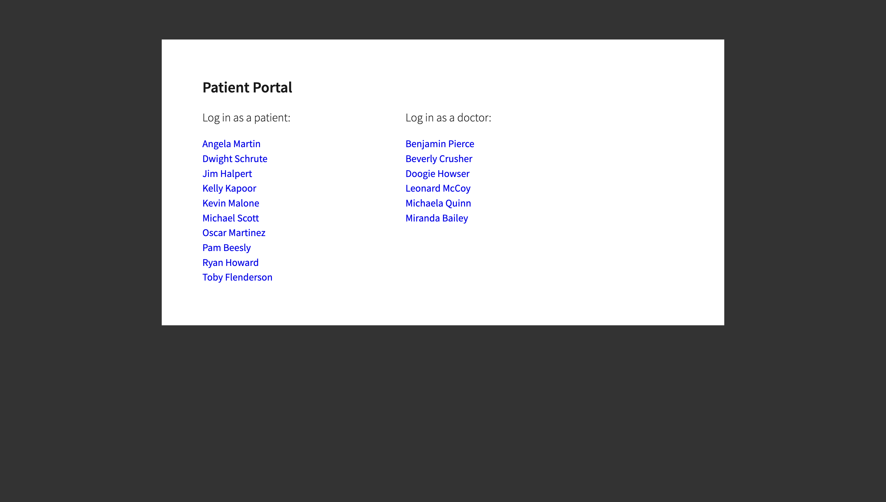
+
[NOTE]
====
Refresh the browser tab if you are unable to see the list of patients
====

. Click on the Patient Angela Martin.
+
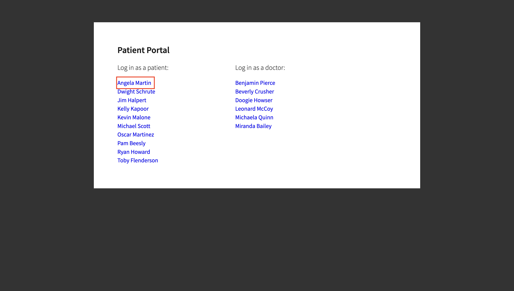

. Click the Bills tab to find the unpaid bills and hit the pay button.
+
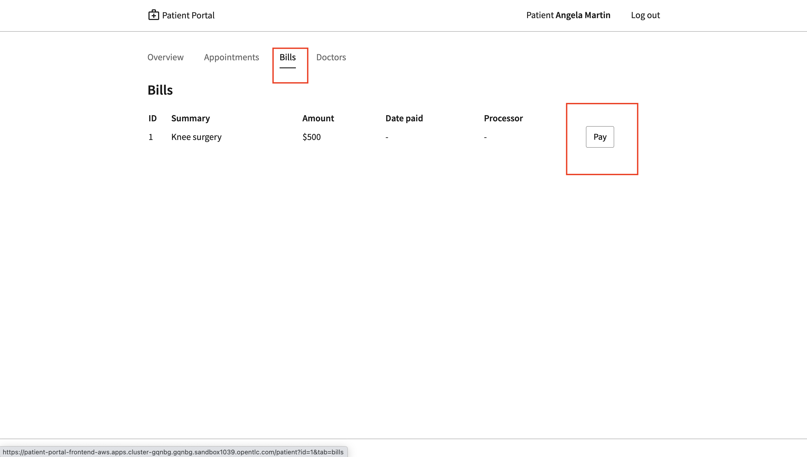

. Submit the payment
+
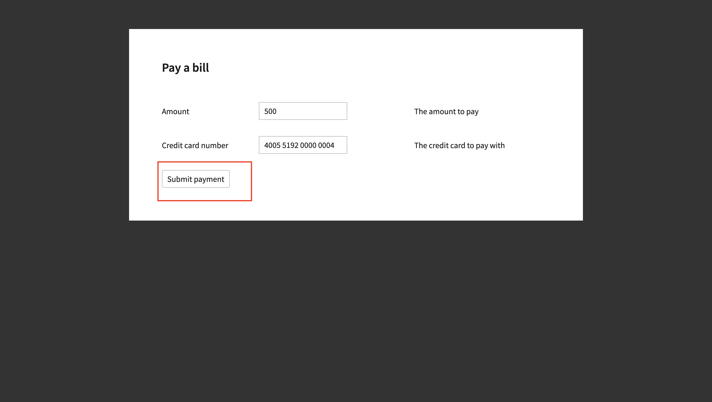

. You should be able to see there is now a Date Paid and the processor location value indicating that the payment is successful. The **Processor** column also shows the location of the payment-portal. This shows that we have successfully connected our payment-processor to the application using Red Hat Service Interconnect.
+
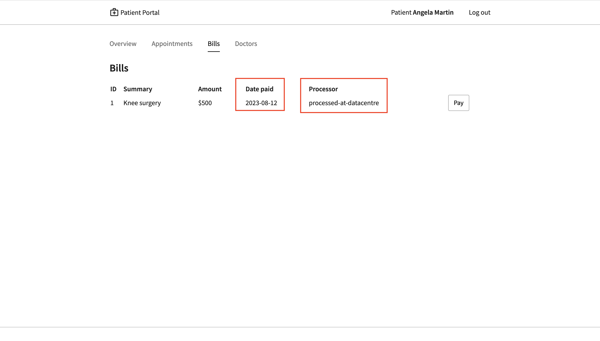

Congratulations! You successfully used Red Hat Service Interconnect to build a secure service network between services on two different environments (OpenShift Cluster and RHEL Datacentre) and allowed application to connect and communicate over the secure network.

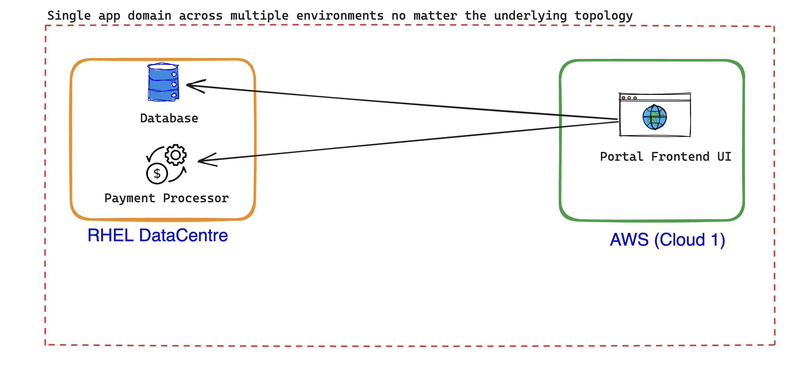

Click **Next** to proceed to the next scenario.

[type=taskResource]
.OpenShift Links
****
* link:{openshift-host}/topology/ns/{aws-namespace}[AWS Developer Console, window="_blank"]
* link:{azure-console}/topology/ns/{azure-namespace}[Azure Developer Console, window="_blank"]
****

[type=taskResource]
.RHEL Login
****
* `ssh lab-user@{rhel-hostname}`
****

[type=taskResource]
.Common Credentials
****
* *username:* `{user-username}`
* *password:* `{aws-password}`
****

[time=10]
[id="component-ha"]
== Scenario 2 - Enabling high availability of the Payment-processor with Red Hat Service Interconnect

MediCorp decided to add scalability and resiliency by running additional Payment Processor instances on a new OpenShift cluster on Azure, while some instances of the payment-processor  as well as the database still remain in the data center.

Azure provides certified EU data centres that adhere to regulatory requirements. Also at the same time the payment processor in the Azure cluster provides high availability and is expected to take over when the payment processor in the Datacentre goes down. In the next steps we will see how Red Hat Service interconnect enables this.

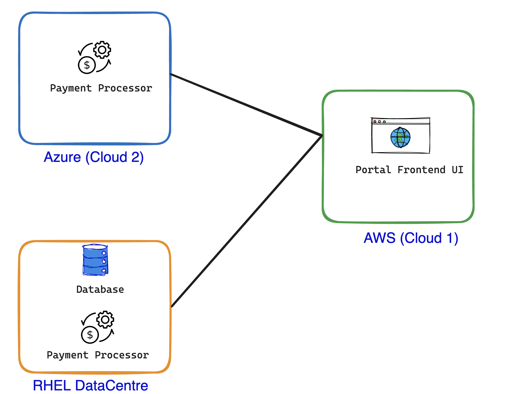

=== Deployment overview: Azure cluster
. Open the console of the OpenShift cluster on Azure link:{azure-console}/topology/ns/azure[Azure Developer Console, window="_blank"]
+
*username:* `{user-username}`
+
*password:* `{aws-password}`

. Double check to make sure you are in the azure namespace and expect to see payment-processor deployed. 
+
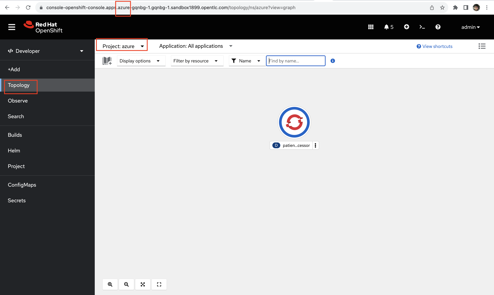

=== Connecting the frontend deployed on OpenShift in AWS to the other instance of the payment processor deployed on OpenShift in AWS
Building a Service network between the two environments AWS and Azure  (more precisely between namespaces of the two OpenShift clusters.

. Install Service Interconnect router in both environments.

. Create a connection token in the AWS cluster.

. Use the token on the Azure to create a link between the namespaces of openshift clusters.

. Expose services of one environment on the other. In this case, you will expose the  payment-processor on Azure, so that the frontend can connect to it as if they were locally deployed. 

. Recollect that in this scenario the front end is connected to two instances of the payment-processor: one in the data centre (link already established ) and the other in the Azure cluster (connection yet to be established). Both these instances together are intended to provide HA for the payment-processor. i.e, if one goes down the other will seamlessly take over. 

=== Initialize Red Hat Service Interconnect in the Azure cluster

. Open the browser window pointing to the OpenShift Console of the AWS OpenShift cluster. Click on the openshift command line terminal on the top menu to open a terminal window.
+

. The terminal should take two to three minutes to start up. Once done you should see something like this
+
image::images/azure_terminal_started.png[azure_terminal_started, role="integr8ly-img-responsive"]

. Make sure the terminal is logged into the azure project
+
[source,bash,role=copy]
----
oc project azure
----
+
.Output
----
Now using project "azure" on server "https://172.30.0.1:443"
----

. Initialize the Service Interconnect Router by issuing the below command in the aws terminal. This should install the Service Interconnect resources in the aws namespace
+
[source,bash,role=copy]
----
skupper init
----

=== Create a link between the namespace on AWS and Azure cluster

Since we have already initialized the Service Interconnect router in the aws namespace in the AWS cluster in the previous scenario, we do not need to repeat that step. We just need to create a token in the AWS environment that would be used by the Azure cluster

. Navigate to the browser tab pointing to the OpenShift Web terminal on the *AWS cluster* 
+

+

.. **NOTE:** If you are logged out of the terminal for any reason. Click on the *Reconnect to terminal* button and and issue the `oc project aws` command to log back into the aws namespace
+

. Issue the following command
+
[source,bash,role=copy]
----
skupper token create secret_aws_azure.token
----
+
.Output
----
Token written to secret_aws_azure.token
----

. Display the token using the below command and copy it in a notepad or any text editor of your choice
+
[source,bash,role=copy]
----
cat secret_aws_azure.token
----
+
.Output
----
apiVersion: v1
data:
  ca.crt: LS0tLS1CRUdJTiBDRVJUSUZJQ0FURS0tLS0tCk1JSURMRENDQWhTZ0F3SUJBZ0lRU3RqbXd4Z2dOVWtkZnhOa1RManYxakFOQmdrcWhraUc5dzBCQVFzRkFEQWEKTVJnd0ZnWURWUVFERXc5emEzVndjR1Z5TFhOcGRHVXRZMkV3SGhjTk1qTXdPREV5TURnek16UXdXaGNOTWpndwpPREV3TURnek16UXdXakFhTVJnd0ZnWURWUVFERXc5emEzVndjR1Z5TFhOcGRHVXRZMkV3Z2dFaU1BMEdDU3FHClNJYjNEUUVCQVFVQUE0SUJEd0F3Z2dFS0FvSUJBUUM1ZktmWHlEeEg5Q0lHNUdpbU5Ob29heGl4UGIwWkNyMVUKM2J1c1lMQm5HZmZ3MEZQMEVPeUsrTVQyWEptOXdiVkNNY2tQOFp6UjFKRFZoeWpBK3AxRDlWQjRCeHpHYkVGQwp2aXhJOFcvUWdMRk85L1Q3RnN4czNUMmprTExTSVBlRDA2ZVJvQm9oMnpwNzZRV3JMVVdwZlJTNmtobG11NEpOCkJhRWdnTWpXMlhZQVh4YithWWI0ZWdTZSt4SUFXZG5UM2JjTExSQkw2dHY2MDVTdnhLeTVVSXVBRjFLTU5oeEoKbDFOd2xqd0p5ZVFwZzlWcEl2bzduUWlYNFM3Nm0rRHN0MUU5U3k5NUNQNEcrYy96bWJzZjk0TlJaWWlwQ29FeQo3KzNxOVJNSU5NZVY4VEdINEFVMHgxRGhiMWJ1RmxLTGJRR3RENjAyd2Rqa2ViSWVjcGRmQWdNQkFBR2piakJzCk1BNEdBMVVkRHdFQi93UUVBd0lDcERBZEJnTlZIU1VFRmpBVUJnZ3JCZ0VGQlFjREFRWUlLd1lCQlFVSEF3SXcKRHdZRFZSMFRBUUgvQkFVd0F3RUIvekFkQmdOVkhRNEVGZ1FVWGdqMGxHK0o0cVVWY1JQK29aWlE3bHVXRUFJdwpDd1lEVlIwUkJBUXdBb0lBTUEwR0NTcUdTSWIzRFFFQkN3VUFBNElCQVFDRndxZXFpZWt1UDJFNUVWVVJzbi9tCnBVZFZKbUJKWTd2cTJjdm1KaVdSYlF6dEZEY3diUUlKdHArN0I2TGRQVGpBYkNUYU5MTEl6aUNhZlkrS1ZkeW4KR09RWmRlWHlvOWlzdnhJL1hOSzVLY28zbXN0VDRObXd3MWhRVVBvVGd6UUFNWURlNk0wcjRqa3MzbVhreHlwZgozdDdWalF2cUIxd044RFZ2cHc5RytQbllCK1ZiamEvMkZVSks2YkJudmdlL0ZPL08yTm5GeTdJUU1FYXpFdVZ4Ck8rcEFsNlFTSFlQYkpocko1YlBIa1lCSng2MFVSMEVjSVhXMGZWU21SWXplMmE4R05vZ016WDZWNVZtZ1JyL2sKU09KU0Z1WU1oMmh6R1oxdldQVTZ6YWhMeVlXUUFvZWNzVTNiaFpjVEFJdFk3OU9WaE1LbGswY1B3UTdGVHZ3QwotLS0tLUVORCBDRVJUSUZJQ0FURS0tLS0tCg==
  password: UFZIZjhCRnJvdDVJaWFlcXlZVm5zTm14
kind: Secret
metadata:
  annotations:
    skupper.io/generated-by: 87c49ffc-6440-4261-9270-d5831c6e1725
    skupper.io/site-version: 1.4.1
    skupper.io/url: https://claims-aws.apps.cluster-gqnbg.gqnbg.sandbox1039.opentlc.com:443/789cb2df-3907-11ee-910f-0a580a800150
  creationTimestamp: null
  labels:
    skupper.io/type: token-claim
  name: 789cb2df-3907-11ee-910f-0a580a800150
----
+
[NOTE]
====
Do not copy the token from the instructions. Copy the token from the terminal. 
====
+
This is actually an OpenShift secret which contains a certificate. This certificate will be used to setup a mTLS (mutual TLS) secured link between the two environments.
+
The next step is creating the link on the Azure cluster with the token. 

. Navigate to the *Azure terminal*
+
image::images/azure_terminal_started.png[azure_terminal_started, role="integr8ly-img-responsive"]

.. **NOTE:** If you are logged out of the terminal for any reason. Click on the *Reconnect to terminal* button and and issue the `oc project azure` command to log back into the azure namespace
+

. Create a new file on the *Azure cluster* where you will paste the token you just generated on the AWS cluster.
+
[source,bash,role=copy]
----
vi secret_aws_azure.token
----

. Paste the token in this file and save it using the buttons esc followed by :wq and hit enter to save the file 

. Create a link on the  *Azure cluster* using the token
+
[source,bash,role=copy]
----
skupper link create secret_aws_azure.token --name aws-to-azure
----
+
.Output
----
Site configured to link to https://claims-aws.apps.cluster-gqnbg.gqnbg.sandbox1039.opentlc.com:443/789cb2df-3907-11ee-910f-0a580a800150 (name=aws-to-azure)
Check the status of the link using 'skupper link status'.
----

. Finally, you need to expose the payment-processor service over the link. Issue the below command in *Azure terminal* .This will allow the frontend app to connect to the payment-processor on *Azure*.
+
[source,bash,role=copy]
----
skupper expose deployment/patient-portal-payment-processor --address payment-processor --port 8080 --protocol http
----
+
Now we have two payment-processors one in the datacentre and the other in the Azure cluster. Service Interconnect by default provides HA for the payment-processor using these two instances as they are part of the same service network. If the payment-processor in the datacentre has a lot of concurrent requests or if it goes down the payment-processor in the Azure datacentre will seamlessly take over.
+
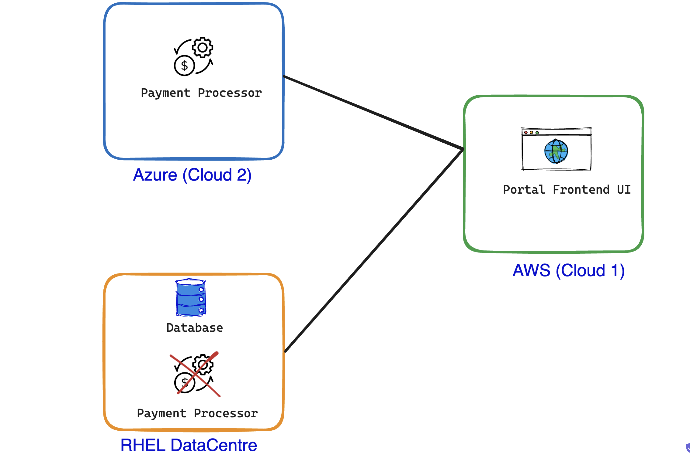

. Click this link:https://patient-portal-frontend-aws.{aws-subdomain}[link, window="_blank"] to access the patient portal.

. Click on the Patient Jim Halpert
+
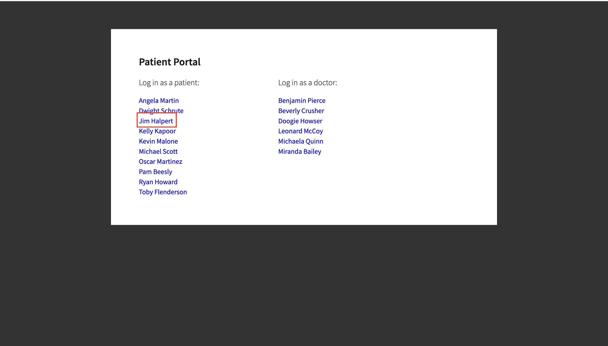

. Click the Bills tab to find the unpaid bills and hit the pay button for the first bill.
+
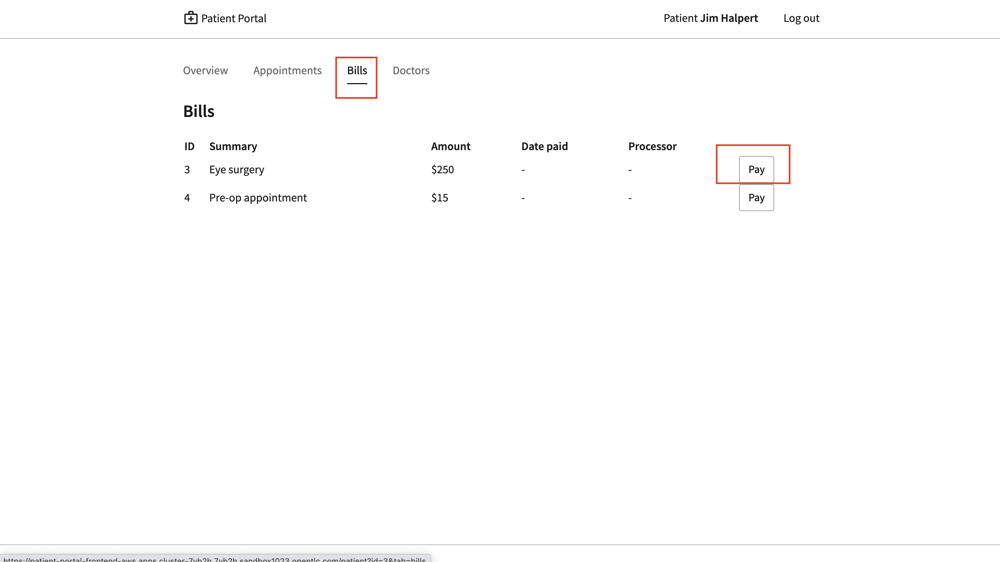

. Submit the payment
+
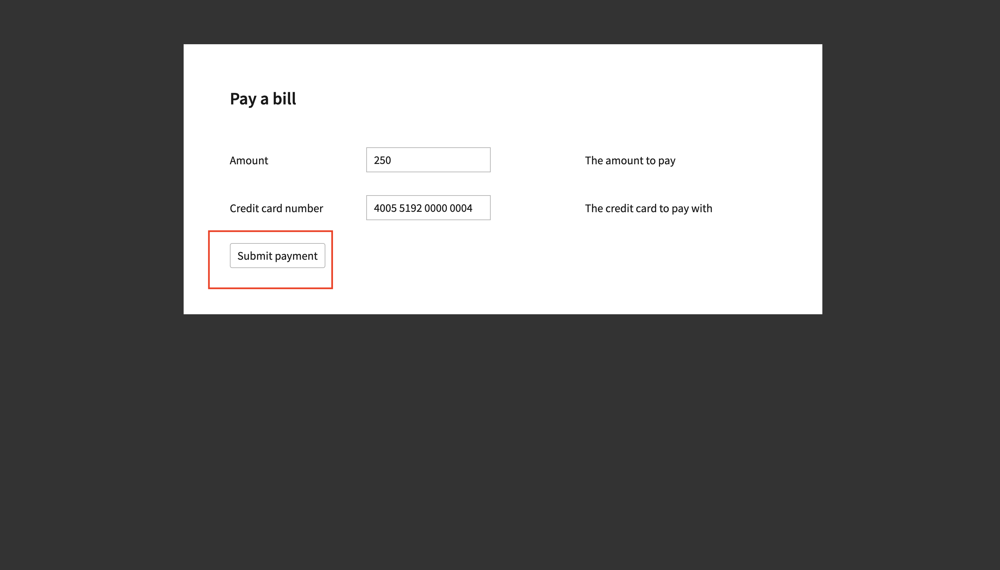

. You should be able to see there is now a Date Paid and the processor location value indicating that the payment is successful. The **Processor** column shows the **payment was processed at the datacentre**
+
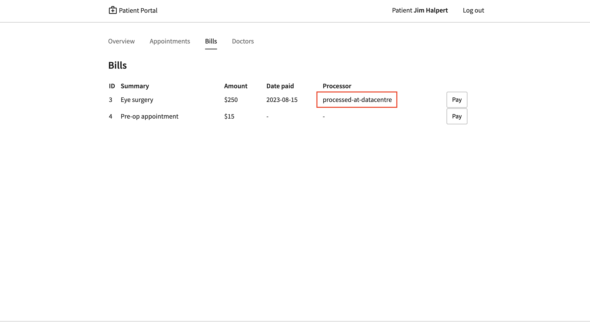

. Now let's take down the payment-processor in the datacentre and see if the one in the Azure cluster takes over.  

. Navigate to the RHEL datacentre terminal that you have connected earlier to using the terminal on your local machine. Make sure you are logged in as lab-user@bastion

. Instead of killing the container running the payment-processor in the datacentre, let's just unexpose it over the network and make it unaccessible. Run the below command in the temrinal of RHEL datacentre
+
[source,bash,role=copy]
----
skupper unexpose host host.containers.internal --address payment-processor 
----

. Go back to the patient portal or Click this link:https://patient-portal-frontend-aws.{aws-subdomain}[link, window="_blank"] to access the patient portal.

. Now try to make the second payment for patient Jim Halpert
+
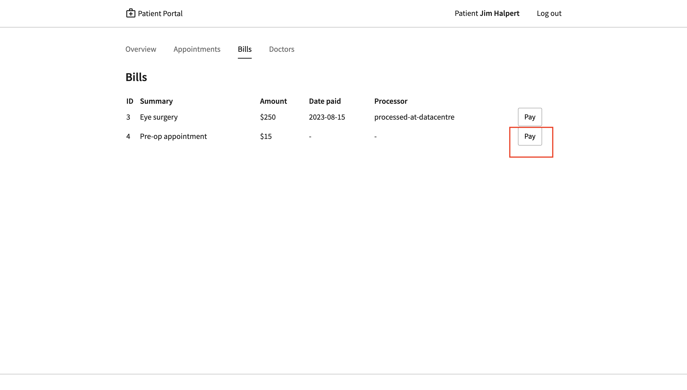

. Submit the payment
+
image::images/jim_second_submit.png[jim_second_submit, role="integr8ly-img-responsive"]

. You should be able to see there is now a Date Paid and the processor location value indicating that the payment is successful. The **Processor** column now shows the payment was **processed at azure**
+
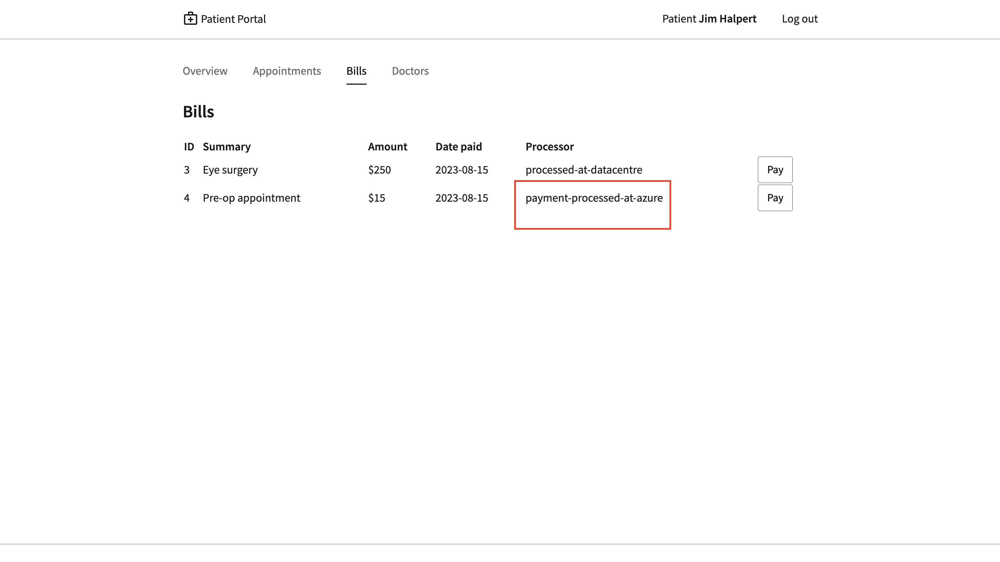

This shows that the payment-processor in Azure cluster has taken over as soon as we made the processor in the datacentre unavailable over the network. As indicated in the image above the first payment was processed by RHEL datacentre and as soon as we took it down the second payment was processed by Azure cluster.

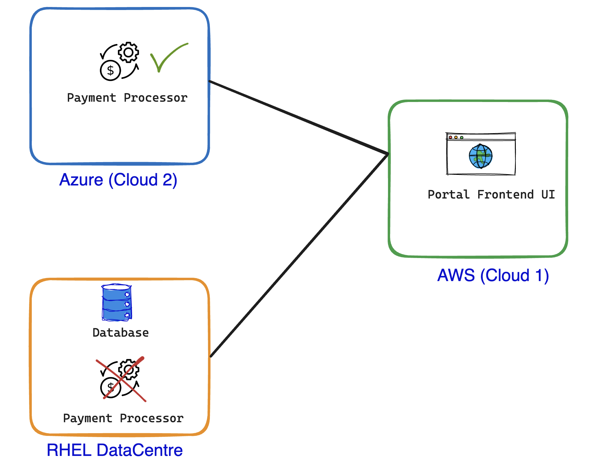

Click **Next** to proceed to the next scenario.

[type=taskResource]
.OpenShift Links
****
* link:{openshift-host}/topology/ns/{aws-namespace}[AWS Developer Console, window="_blank"]
* link:{azure-console}/topology/ns/{azure-namespace}[Azure Developer Console, window="_blank"]
****

[type=taskResource]
.RHEL Login
****
* `ssh lab-user@{rhel-hostname}`
****

[type=taskResource]
.Common Credentials
****
* *username:* `{user-username}`
* *password:* `{aws-password}`
****

[time=10]
[id="network-ha"]
== Scenario 3 - Enabling high availability of the service network with Red Hat Service Interconnect

In the previous scenario we've seen that Red Hat Service Interconnect can be used to provide High availability/replication for services across different environments where if one instance goes down, the other instance with the same service name takes over seamlessly. 

In this scenario we will learn about another aspect Red Hat Service Interconnect where it provides high availability for the network connections. For example, in the previous scenario for the patient portal on AWS to access the payment processor on Azure, we established a direct skupper network connection between AWS and Azure. What if the network between AWS and Azure is unstable for some reason. Red Hat Service Interconnect looks for alternative paths to reach the payment-processor on Azure if the direct link is unstable or broken.

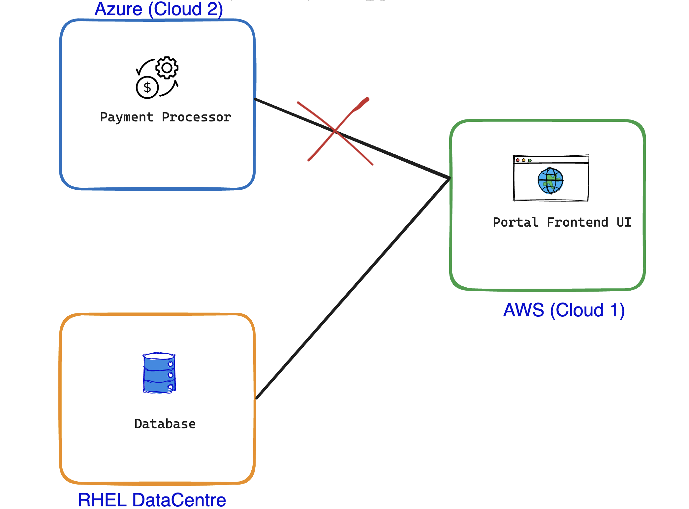

To replicate the above scenario we will do the following steps:

. Create a direct skupper network connection between RHEL datacentre and Azure
. Delete the direct connection between AWS and Azure
. Verify if the patient portal on AWS is able to access the payment processor on Azure using the alternate path(AWS --> Datacentre --> Azure) in the absence of a direct path. 
. Note: Recollect that in the previous scenario we have taken down the payment processor in the RHEL datacentre. So the only instance currently available is the one in the Azure cluster. 

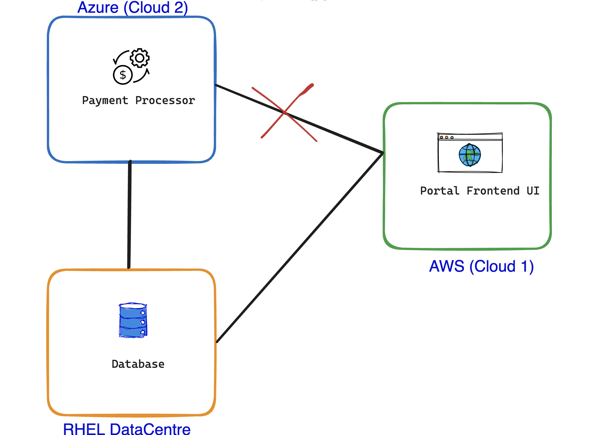

=== Creating a link between RHEL Datacentre and Azure cluster

Since we have already initialized the Service Interconnect router in the azure namespace in the Azure cluster in the previous scenario and the RHEL datacentre, we do not need to repeat that step. We just need to create a token in the Azure environment that would be used by the Datacentre

. Navigate to the *Azure terminal*
+
image::images/azure_terminal_started.png[azure_terminal_started, role="integr8ly-img-responsive"]

.. **NOTE:** If you are logged out of the terminal for any reason. Click on the *Reconnect to terminal* button and issue the `oc project azure` command to log back into the azure namespace
+

. Issue the following command
+
[source,bash,role=copy]
----
skupper token create secret_azure_vm.token
----
+
.Output
----
Token written to secret_azure_vm.token 
----

. Display the token using the below command and copy it in a notepad or nay text editor of your choice
+
[source,bash,role=copy]
----
cat secret_azure_vm.token
----
+
.Output
----
apiVersion: v1
data:
  ca.crt: LS0tLS1CRUdJTiBDRVJUSUZJQ0FURS0tLS0tCk1JSURMVENDQWhXZ0F3SUJBZ0lSQU5PeVBabytJT1RUeW9xVUt2Y09sRGt3RFFZSktvWklodmNOQVFFTEJRQXcKR2pFWU1CWUdBMVVFQXhNUGMydDFjSEJsY2kxemFYUmxMV05oTUI0WERUSXpNRGd4TlRBMk1EY3dObG9YRFRJNApNRGd4TXpBMk1EY3dObG93R2pFWU1CWUdBMVVFQXhNUGMydDFjSEJsY2kxemFYUmxMV05oTUlJQklqQU5CZ2txCmhraUc5dzBCQVFFRkFBT0NBUThBTUlJQkNnS0NBUUVBeU5xR0tsTWZ6QnFtZnhTdkx4TEVqOXZJbEVRZGdURWUKQVI3RDVCSmhqN08wZlF3VXpWR1V6bDJzUmRjWHFxL0VqbUY4bDd5bWd3T2JiSGxieFFNdE5sc3dXOFdWSW9EYQpvMzYraU8yRzhoMWVEdTdTQ0F2Skh4ajBmWEVkeTkyRmZWb0FRdWNWTnp6NzdPRVFFRk1rK3l4Q0xOWXBxTmVjCjlhRVZ1bERmakRjd2NmU05EcURNc2VDTGhVNTd4MmRDd1lpVHFHUjBqMGdRTUQzbFc2dENNTWVBamQ3QUVjT0UKdVZJUkd4eUtJRHE1NnBESEVKNkIzM0NDbkJCeG5CMnhQcHpQOW1vRmhrNnRtc0UzWnpGdTd3MzQzMGh2aW5SVgpzckdiTHFnVnFWZldQMnE3VkJFWTRnNG9ZbEhJYjdwWURRV0RHZDhLeTdsU3dkTGFWWXNialFJREFRQUJvMjR3CmJEQU9CZ05WSFE4QkFmOEVCQU1DQXFRd0hRWURWUjBsQkJZd0ZBWUlLd1lCQlFVSEF3RUdDQ3NHQVFVRkJ3TUMKTUE4R0ExVWRFd0VCL3dRRk1BTUJBZjh3SFFZRFZSME9CQllFRkxpTkZLYUJwYm9MVjVyZXJRWHVWS0UzVTZDTApNQXNHQTFVZEVRUUVNQUtDQURBTkJna3Foa2lHOXcwQkFRc0ZBQU9DQVFFQUREbVNrNEJNMW5YZzZDdjh0MnRuCnhOKzhXV0k5U0NEYjA5ZGRFZjZ3K2hJOWh1RnJTRDJ0Vktvc2hXbXEyelFOaVR3Z2tHampFK2ZRenRPaTFtVHYKd1ZXVldUcGREMmxYdlBvOFJZWEJmU0hEeTdMRUt6Y1ZlUmdFTUdWdWN1QjVXREFOeE9Cc055MXRjOHpuZ0tsOQpBTTRyZk44UjUzcERlMzZ1Mi9qQkgzaXk1Y0ovM2NOckJxWGVEc3ZyZGVCSGVlaVNRYUM1UWtFTUhLR1JYclY4Cng3SUczVWpPbUpacEZ0ODVXb3Q5Tjg2TDZDckFVd25HTWo1bXhpeG82dmFFbkRmejVjRzBEYnFPNnQ5TWh1L00KNWlEZDlLd1o1YTIrVE9qQjBKWWNuMUw4bVEvS1hlalhpOG9USDZEMGxqSjFxM0d1UkZ0UGtMT0VSalI2Q3AycwpPZz09Ci0tLS0tRU5EIENFUlRJRklDQVRFLS0tLS0K
  password: ZmRCUUNUMGFxakxMd01MTXhVbWp5dzE1
kind: Secret
metadata:
  annotations:
    skupper.io/generated-by: 7c263c46-188b-4e8d-ac4e-e66a649daedc
    skupper.io/site-version: 1.4.1
    skupper.io/url: https://claims-azure.apps.azure-7vb2h-1.7vb2h-1.sandbox3176.opentlc.com:443/8cbee1b2-3b37-11ee-becd-0a580a800097
  creationTimestamp: null
  labels:
    skupper.io/type: token-claim
  name: 8cbee1b2-3b37-11ee-becd-0a580a800097
----
+
[NOTE]
====
Do not copy the token from the instructions. Copy the token from the terminal. 
====
+
This is actually an OpenShift secret which contains a certificate. This certificate will be used to setup a mTLS (mutual TLS) secured link between the two environments.
+
The next step is creating the link on the RHEL datacentre with the token. 

. Navigate to the RHEL datacentre terminal that you have connected earlier to using the terminal on your local machine. Make sure you are logged in as lab-user@bastion

. Create a new file on the *RHEL datacentre* where you will paste the token you just generated on the Azure cluster.
+
[source,bash,role=copy]
----
vim secret_azure_vm.token
----

. Paste the token in this file and save it using the buttons esc followed by :wq and hit enter to save the file 

. Create a link on the  *RHEL datacentre* using the token
+
[source,bash,role=copy]
----
skupper link create secret_azure_vm.token --name azure-to-vm
----
+
.Output
----
Site configured to link to skupper-inter-router-azure.apps.azure-7vb2h-1.7vb2h-1.sandbox3176.opentlc.com:443 (name=azure-to-vm)
Check the status of the link using 'skupper link status'.
----

=== Deleting the direct link between AWS and Azure cluster
We have now established a direct link between the Datacentre and Azure cluster. In the next steps we will delete the direct link AWS and Azure and verify if the patient portal in the frontend is able to able to reach the payment-processor of Azure via the Datacentre (indirect connection)

. Navigate to the *Azure terminal*
+
image::images/azure_terminal_started.png[azure_terminal_started, role="integr8ly-img-responsive"]

.. **NOTE:** If you are logged out of the terminal for any reason. Click on the *Reconnect to terminal* button and and issue the `oc project azure` command to log back into the azure namespace
+

. Delete the direct link between AWS and Azure
+
[source,bash,role=copy]
----
skupper link delete aws-to-azure
----
+
.Output
----
Link 'aws-to-azure' has been removed
----

. Check the status of the skupper network
+
[source,bash,role=copy]
----
skupper status
----

. You should see an output similar to the one below
+
[source,bash,role=copy]
----
Skupper is enabled for namespace "azure" in interior mode. It is connected to 2 other sites (1 indirectly). It has 2 exposed services.
----

. Examine the output carefully. You will notice that the output indicates that Azure is to connected 2 sites but **1 amongst the connections is indirect** . This indicates that Azure is connected to AWS indirectly. 

. To verify if the connection, works properly lets try to make payment for another patient. Click this link:https://patient-portal-frontend-aws.{aws-subdomain}[link, window="_blank"] to access the patient portal.

. Now try to make the payment for patient Kevin Malone
+
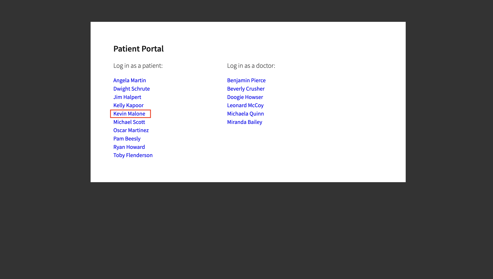

. After completing the payment you should be able to see there is now a Date Paid and the processor location value indicating that the payment is successful. The **Processor** column now shows the payment was **processed at azure**
+
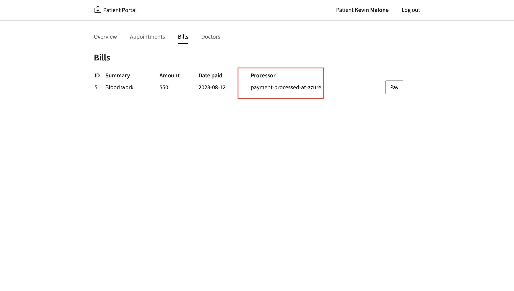
+
This indicates that though the direct link is broken the patient portal in AWS is able to reach the payment-processor in Azure indirectly

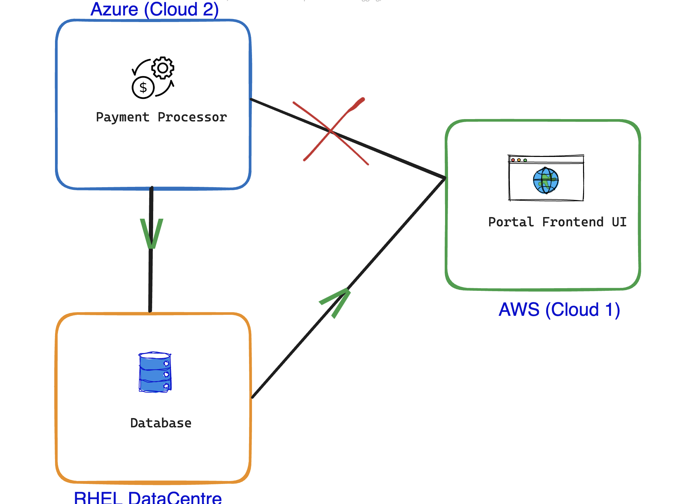

Click *Next* to proceed

[type=taskResource]
.OpenShift Links
****
* link:{openshift-host}/topology/ns/{aws-namespace}[AWS Developer Console, window="_blank"]
* link:{azure-console}/topology/ns/{azure-namespace}[Azure Developer Console, window="_blank"]
****

[type=taskResource]
.RHEL Login
****
* `ssh lab-user@{rhel-hostname}`
****

[type=taskResource]
.Common Credentials
****
* *username:* `{user-username}`
* *password:* `{aws-password}`
****

[time=2]
[id="Conclude"]
== Additional Resources

This brings us to the end of all the demo scenarios. Learn more about Red hat Service Interconnect using the resources below:

* link:https://www.redhat.com/en/technologies/cloud-computing/service-interconnect[Red Hat Service Interconnect Website, window="_blank"]

* link:https://developers.redhat.com/products/service-interconnect/overview[Red Hat Service Interconnect Developers Website, window="_blank"]

