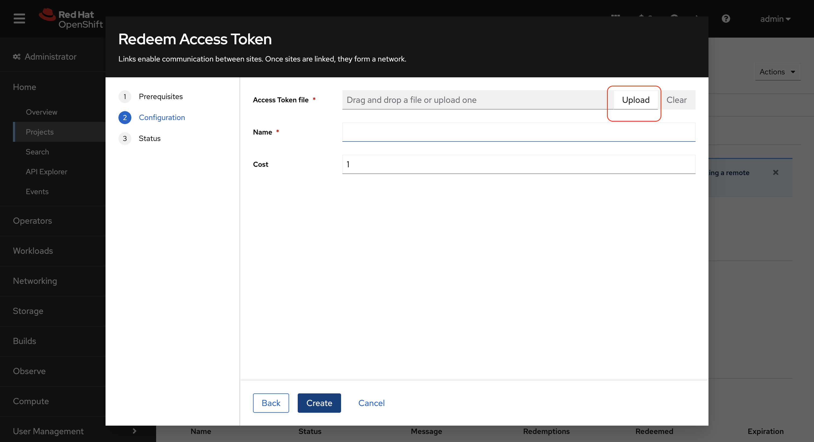
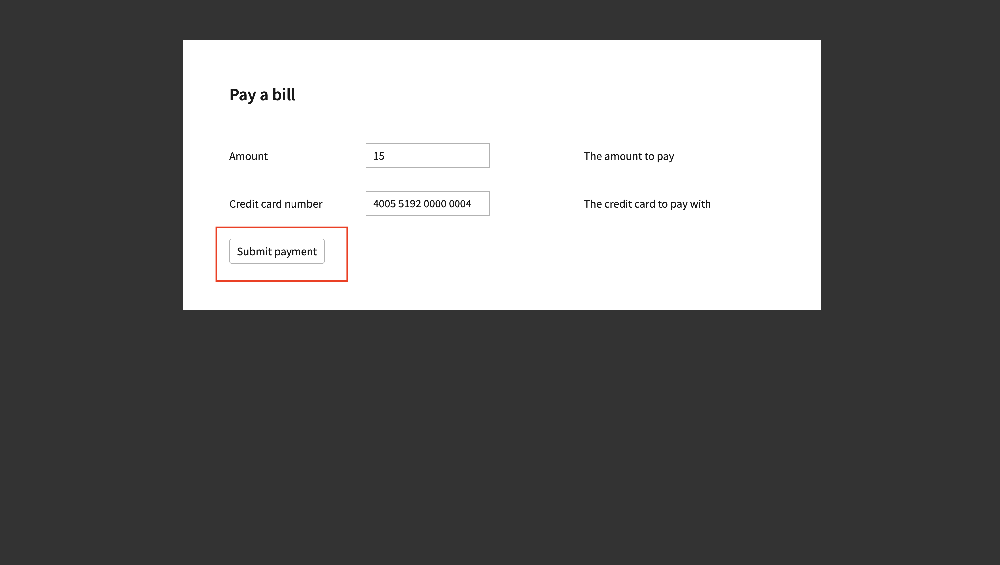
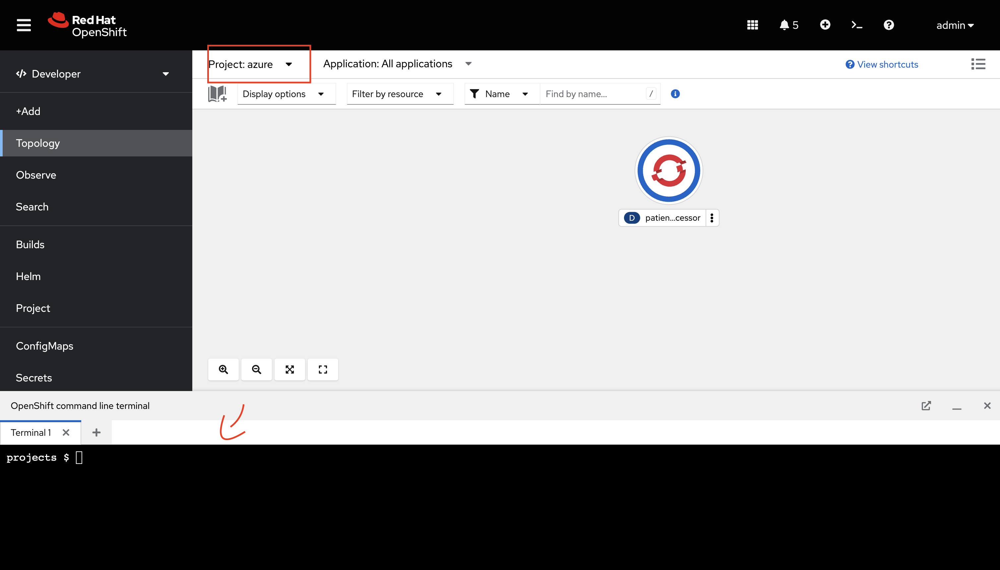

// Attributes
:walkthrough: Connecting applications across clouds with Red Hat Service Interconnect
:title: Lab 1 - {walkthrough}
:user-password: {aws-password}
:standard-fail-text: Verify that you followed all the steps. If you continue to have issues, contact a workshop assistant.
:aws-namespace: aws
:azure-namespace: azure
:frontend-namespace: {user-username}-patient-front
:backend-namespace: {user-username}-patient-back
:rhosak: Red Hat OpenShift Streams for Apache Kafka
:rhoas: Red Hat OpenShift Application Services
:cloud-console: https://console.redhat.com
:codeready-project: FleurDeLune
:example-caption!:

// URLs
:openshift-streams-url: https://console.redhat.com/beta/application-services/streams/kafkas
:next-lab-url: https://tutorial-web-app-webapp.{openshift-app-host}/tutorial/dayinthelife-streaming.git-labs-02-/
:codeready-url: https://devspaces.{openshift-app-host}/
:openshift-console: http://console-openshift-console.{openshift-app-host}/

[id='service-interconnect']
= Connect your services across different environments with Red Hat Service Interconnect

In this lab you discover how to build a service network to connect disparate services across different environments using Red Hat Service Interconnect.

[time=2]
[id="Red Hat Service Interconnect"]
== What is Red Hat Service Interconnect?
Red Hat Service Interconnect enables application and service connectivity across different environments through layer 7 addressing and routing. Using a simple command line interface, interconnections are created in a matter of minutes, avoiding extensive networking planning, and overhead. All interconnections between environments use mutual TLS(mTLS) to keep your organization’s infrastructure and data protected. Red Hat Service Interconnect is based on the open source Skupper project.

Click *Next* to proceed

[time=2]
[id="MediCorp Intro"]
== Modernizing MediCorps Legacy Patient Portal

Let us delve into the world of MediCorp, a healthcare organization offering a comprehensive portal for both doctors and patients. This portal facilitates various tasks for patients, including bill payments and appointment checks.

Presently, the patient portal is a monolithic application, which has been causing significant collaboration challenges between the front-end and back-end teams. Furthermore, it struggles to maintain efficiency and scalability during peak hours, resulting in sluggish performance and increased expenses.

In response, MediCorp has made the strategic decision to revamp their application, transitioning it into a set of microservices. These microservices will be distributed across different environments, enhancing scalability and overall performance.

Outlined below are the key challenges and questions that arose during this transformation process:

**Seamless Transition**: The modernization process is not an instantaneous change, requiring time and careful implementation. However, it's imperative that our existing application continues to function smoothly during this transition period.

**Integration of Old and New**: The integration of the "old" and the new microservices presents its own set of complexities. What happens when certain components cannot be migrated to containers and must remain in the current datacenter?

**Hybrid Cloud Possibilities**: Exploring the potential of a hybrid cloud approach with multiple service providers adds another layer of consideration to the modernization journey.

Join us in this lab as we take you through MediCorp's transformational journey. Discover how they harnessed the power of Red Hat Service Interconnect as a pivotal component of their modernization strategy, effectively tackling the challenges mentioned above and more.

Click *Next* to proceed

[type=taskResource]
.OpenShift Links
****
* link:{openshift-host}/topology/ns/{aws-namespace}[AWS Developer Console, window="_blank"]
* link:{azure-console}/topology/ns/{azure-namespace}[Azure Developer Console, window="_blank"]
****

[type=taskResource]
.RHEL Login
****
* `ssh lab-user@{rhel-hostname}`
****

[type=taskResource]
.Common Credentials
****
* *username:* `{user-username}`
* *password:* `{aws-password}`
****

[time=10]
[id="creating-connections"]
== Scenario 1 - Connecting the frontend deployed on OpenShift in AWS to the database and payment processor deployed in the data centre. 

Addressing the biggest issue first, MediCorp separated the Frontend from the Payment Processor Backend, allowing for more flexibility, independent deployment and scalability.
Given the tight coupling between JSF and the backend, MediCorp decided to re-implement the frontend as a lightweight Python application. All application components are still running in RHEL VMs in the data center. 

image::images/all_rhel_arch.png[all_rhel_arch, role="integr8ly-img-responsive"]

To leverage scalability and resilience for the frontend, MediCorp wants to move the Frontend to OpenShift on AWS, while the payment processor and database remain in the data center, mainly because there are regulatory requirements that require data processing or storage to happen on-prem or in specifically certified data centres. Below is the desired state and architecture that we will try to achieve in this scenario.

image::images/ui-aws-arch.png[ui-aws-arch, role="integr8ly-img-responsive"]

The following steps will showcase how you can connect the frontend to services(database and payment-processor) in the datacentre using Red Hat Service Interconnect. Note that none of these services are exposed to the public internet

=== Deployment overview: AWS cluster
. Open the console of the  link:{openshift-host}/topology/ns/aws[OpenShift cluster on AWS, window="_blank"]
+
*username:* `{user-username}`
+
*password:* `{aws-password}`

. Double check to make sure you are in the aws namespace and expect to see frontend (called patient-portal-frontend) deployed. 
+

. You can check the state of the application by clicking on the route icon next to the frontend deployment as shown below.
+
image::images/route_icon.png[route_icon, role="integr8ly-img-responsive"]

. This opens a new browser tab pointing to the home page of the Patient portal application. You should be able to see the front end of the patient portal without any patient names or doctor names as we have not established the connection with the database and payment-processor deployed in the RHEL virtual machine.
+

=== Deployment overview: RHEL Datacentre
. Open the terminal on your local machine and login to the RHEL datacentre
+
[source,bash,subs="attributes+"]
----
ssh lab-user@{rhel-hostname}
----
+
.Output
----
The authenticity of host 'bastion.gqnbg-2.sandbox518.opentlc.com (3.130.48.14)' can't be established.
ED25519 key fingerprint is SHA256:pYM2sFBYn/rijF9/87rNYbnRyeFRm4EkeQejpGhVQow.
This key is not known by any other names
Are you sure you want to continue connecting (yes/no/[fingerprint])?
----

. Type **yes** and enter the below password
+
[source,bash,subs="attributes+"]
----
{aws-password}
----

. You should now be logged in as lab-user in the RHEL datacentre. The database and payment-processor are already deployed on the RHEL datacentre using podman. Run the below command in your RHEL datacentre terminal to confirm the that the database and payment-processor as running in the datacentre
+
[source,bash,role=copy]
----
podman ps
----
+
.Output
----
CONTAINER ID  IMAGE                                                                 COMMAND         CREATED      STATUS          PORTS                   NAMES
c54976092427  quay.io/redhatintegration/patient-portal-payment-processor:devnation                  2 hours ago  Up 2 hours ago  0.0.0.0:8080->8080/tcp  portal-payments
07fea4fd2671  quay.io/redhatintegration/patient-portal-database:devnation           run-postgresql  2 hours ago  Up 2 hours ago  0.0.0.0:5432->5432/tcp  portal-database
----

=== Connecting the frontend deployed on OpenShift in AWS to the database and payment processor deployed in the data centre

Building a Service network between the two environments OpenShift and RHEL datacentre (more precisely between namespace of the OpenShift cluster and the services running on the datcentre) takes several steps:

. Install Service Interconnect router in both environments by setting up the Service interconnect sites

. Create a link configuration including a secure token in the openshift cluster and transfer it to the datacentre.

. Use the link yaml on the datacentre to create a link between the namespaces of openshift cluster and the services running in the datacentre.

. Expose services of one environment on the other using the connectors and corresponding listeners. In this case, you will create connectors for the  database and payment-processor on the datacentre, and corresponding listeners on the openshift cluster. This way the frontend on the openshift cluster can connect to the  database and payment-processor listeners as if the services were locally deployed. 

=== Initialize Red Hat Service Interconnect in the AWS cluster

The easiest way to initialize Red Hat Service Interconnect is through the skupper CLI (Skupper is the name of the open-source upstream project of Red Hat Service Interconnect). In this lab, the skupper cli is available through the OpenShift Command Line terminal, so that you don’t have to install it.

. Open the browser window pointing to the OpenShift Console of the AWS OpenShift cluster. Click on the openshift command line terminal on the top menu to open a terminal window.
+

. The terminal should take two to three minutes to start up. Please be patient. Once done you should see something like this
+

. Make sure the terminal is logged into the aws project
+
[source,bash,role=copy]
----
oc project aws
----
+
.Output
----
Now using project "aws" on server "https://172.30.0.1:443"
----

. Initialize the Service Interconnect site by issuing the below command in the aws terminal. This should install the Service Interconnect resources in the aws namespace
+
[source,bash,role=copy]
----
skupper site create aws --enable-link-access
----
+
.*What is a site?*
====
A site represents a place where you have real running workloads. Each site contains an application service router which helps its workloads connect with workloads in remote sites.

_Ex: A namespace is a site_
====
+
.*What is a router?*
====
Layer 7 application routers form the backbone of a VAN in the same way that conventional network routers form the backbone. 

However, instead of routing IP packets between network endpoints, Layer 7 application routers route messages between application endpoints (called Layer 7 application addresses).
====

=== Initialize Red Hat Service Interconnect in the RHEL Datacentre

Go to the terminal on your local machine where you are logged in to the RHEL datacenter. The skupper cli is also available through the RHEL datacentre terminal that you have connected. 

. Switch the skupper cli podman site mode as we will be using podman to run our skupper containers
+
[source,bash,role=copy]
----
export SKUPPER_PLATFORM=podman
----

. Initialize the Service Interconnect Router by issuing the below command in the RHEL datacentre terminal. 
+
[source,bash,role=copy]
----
skupper site create datacentre
----
+
.Output
----
File written to /home/lab-user/.local/share/skupper/namespaces/default/input/resources/Site-datacentre.yaml
----

=== Setup a listener on the OpenShift cluster and the RHEL datacenter

.*What is a Listener?*
====
A listener creates a local connection point that links to connectors in remote sites using routing keys.  

On Kubernetes, it’s implemented as a Service; on Docker, Podman, and Linux, it’s a listening socket on a local network interface.  

The listener exposes a host/port for local clients while using the routing key to connect with remote sites.
====

. First setup the listener in the AWS cluster by running the below command on the terminal of your AWS OpenShift cluster
+
[source,bash,role=copy]
----
skupper listener create database 5432
skupper listener create payment-processor 8080
----
+
.Output
----
Waiting for create to complete...
Listener "database" is configured.
Waiting for create to complete...
Listener "payment-processor" is configured.
----

=== Setup a Connectors on the the RHEL datacenter

.*What is a Connector?*
====
A connector links a local workload to listeners in remote sites using routing keys.

On Kubernetes, it typically uses a pod selector; on Docker, Podman, and Linux, it uses host and port specifications. 

The routing key is a string identifier that binds the connector to matching listeners in remote sites.
====

. Setup the Corresponding connectors in the RHEL datacentre by running the below commands in the RHEL datacentre terminal.
+
[source,bash,role=copy]
----
skupper connector create database 5432 --host 127.0.0.1
skupper connector create payment-processor 8080 --host 127.0.0.1
----
+
.Output
----
File written to /home/lab-user/.local/share/skupper/namespaces/default/input/resources/Connector-database.yaml
File written to /home/lab-user/.local/share/skupper/namespaces/default/input/resources/Connector-payment-processor.yaml
----

=== Setup a link between the two environments using the link resource

> ****  
> 

.*What is a Link?*
====
A Link resource specifies remote connection endpoints and TLS credentials for establishing a mutual TLS connection to a remote site.  

To create an active link, the remote site must first enable link access.  

Link access provides an external access point for accepting links.
====

To create a link between the environments, you create a link configuration on one of the environments, and then transfer it to create the link on the other.

. Navigate to the browser tab pointing to the OpenShift Web terminal on the *AWS cluster* 
+

.. **NOTE:** If you are logged out of the terminal for any reason. Click on the *Reconnect to terminal* button and and issue the `oc project aws` command to log back into the aws namespace
+

. Issue the following command
+
[source,bash,role=copy]
----
skupper link generate > aws-rhel-link.yaml
----

. Feel free to examine the link configuration using the below command
+
[source,bash,role=copy]
----
cat aws-rhel-link.yaml
----

. Transfer the generated link configuration to the remote rhel datacentre. Run this command on the AWS cluster terminal
+
[source,bash,subs="attributes+"]
----
scp aws-rhel-link.yaml lab-user@{rhel-hostname}:/home/lab-user/.local/share/skupper/namespaces/default/input/resources/
----

. Type 'yes' and 'Enter the password of the RHEL datacentre when prompted
+
[source,bash,subs="attributes+"]
----
{aws-password}
----

. Since the link definition has now been transferred to the RHEL server, start the Virtual Application Network by running the command below from the RHEL terminal.
+ 
[source,bash,role=copy]
----
skupper system setup
----

. Wait for a few seconds, and you should see the following output.
+
.Output
----    
Sources will be consumed from namespace "default"
Site "datacentre" has been created on namespace "default"
Platform: podman
Definition is available at: /home/lab-user/.local/share/skupper/namespaces/default/input/resources
----  

. From the OpenShift AWS Terminal (upper terminal), run the following command to deploy the Service Network Console.
+
[source,bash,role=copy]
----
oc apply -f https://raw.githubusercontent.com/RedHat-Middleware-Workshops/service-interconnect-lab-instructions/refs/heads/main/network_console_deploy.yaml -n aws
----

You will use this console to visualize the network later. Since it takes a few seconds to initialize, go ahead and deploy it now. While it is getting deployed, proceed to the next steps to save time.

=== Testing the Virtual Application Network

. Now go to the browser tab where you've opened the patient-portal frontend or click this link:https://patient-portal-frontend-aws.{aws-subdomain}[link, window="_blank"] to access it. 

. Refresh the page and you should now be able to see the list of patients and doctors that have been retrieved from the database. This shows that we have successfully connected our front end to the database using Red Hat Service Interconnect
+ 

+
[NOTE]
====
Refresh the browser tab a couple of times after waiting a few seconds if you are unable to see the list of patients
====

. Click on the Patient Angela Martin.
+

. Click the Bills tab to find the unpaid bills and hit the pay button.
+
image::images/bill_tab.png[bill_tab, role="integr8ly-img-responsive"]

. Submit the payment
+

. You should be able to see there is now a Date Paid and the processor location value indicating that the payment is successful. The **Processor** column also shows the location of the payment-portal. This shows that we have successfully connected our payment-processor to the application using Red Hat Service Interconnect.
+
image::images/payment-success.png[payment-success, role="integr8ly-img-responsive"]

. Navigate to the   https://skupper-network-observer-aws.{aws-subdomain}[network console, window="_blank"] to visualize the network.

. Choose the Login with OpenShift option and Login using the below credentials
+
.. username: `admin`
.. password: `{aws-password}`

. Click Allow selected permissions
+
 

. You should now be able to visualize the network using the topology view
+
image::images/topology_network-observer.png[]

. Feel free to explore the other views such as the services, Sites, Components and Processes to get a better understanding of the network traffic
+
image::images/network_traffic_observer.png[]

Congratulations! You successfully used Red Hat Service Interconnect to build a secure service network between services on two different environments (OpenShift Cluster and RHEL Datacentre) and allowed application to connect and communicate over the secure network.

image::images/single_app_arch.png[single_app_arch, role="integr8ly-img-responsive"]

Click **Next** to proceed to the next scenario.

[type=taskResource]
.OpenShift Links
****
* link:{openshift-host}/topology/ns/{aws-namespace}[AWS Developer Console, window="_blank"]
* link:{azure-console}/topology/ns/{azure-namespace}[Azure Developer Console, window="_blank"]
****

[type=taskResource]
.RHEL Login
****
* `ssh lab-user@{rhel-hostname}`
****

[type=taskResource]
.Common Credentials
****
* *username:* `{user-username}`
* *password:* `{aws-password}`
****

[time=10]
[id="component-ha"]
== Scenario 2 - Enabling high availability of the Payment-processor with Red Hat Service Interconnect

MediCorp decided to add scalability and resiliency by running additional Payment Processor instances on a new OpenShift cluster on Azure, while some instances of the payment-processor  as well as the database still remain in the data center.

Azure provides certified EU data centres that adhere to regulatory requirements. Also at the same time the payment processor in the Azure cluster provides high availability and is expected to take over when the payment processor in the Datacentre goes down. In the next steps we will see how Red Hat Service interconnect enables this.

image::images/duplicate_processor_arch.png[duplicate_processor_arch, role="integr8ly-img-responsive"]

=== Deployment overview: Azure cluster
. Open the  link:{azure-console}/topology/ns/azure[console of the OpenShift cluster on Azure, window="_blank"]
+
*username:* `{user-username}`
+
*password:* `{aws-password}`

. Double check to make sure you are in the azure namespace and expect to see payment-processor deployed. 
+

=== Connecting the frontend deployed on OpenShift in AWS to the other instance of the payment processor deployed on OpenShift in AWS
Building a Service network between the two environments AWS and Azure  (more precisely between namespaces of the two OpenShift clusters.

. Install Service Interconnect router in both environments.

. Create a connection token in the AWS cluster.

. Use the token on the Azure to create a link between the namespaces of openshift clusters.

. Note: We have the link resource in the previous example and the token in this example. Both are essentially an equivalent way to create the link and even when you examine both the link and token resource you will see that they both contain the tls certificate/credentials information to establish the network

. Expose services of one environment on the other. In this case, you will expose the  payment-processor on Azure, so that the frontend can connect to it as if they were locally deployed. 

. Recollect that in this scenario the front end will be connected to two instances of the payment-processor: one in the data centre (link already established ) and the other in the Azure cluster (connection yet to be established). Both these instances together are intended to provide HA for the payment-processor. i.e, if one goes down the other will seamlessly take over. 

. For this scenario we will use the Service Interconnect OpenShift Plugin. This is another way to create your Virtual application network using a Graphical User Interface right from the OpenShift Console.

=== Initialize Red Hat Service Interconnect in the Azure cluster

. Open the browser window pointing to the  link:{azure-console}/topology/ns/azure[OpenShift Console of the Azure OpenShift cluster, window="_blank"]. 

. Login with username `{user-username}` and password `{aws-password}`

. Navigate to Home → Projects → azure, if you are not already in the azure project.
+

. From the azure project, click on the Service Interconnect tab.
+

. Click on Create site 
+

. Click the Submit button to create a new site with the default values.
+

. Next let's create a connector to the payment-processor in the Azure cluster, so that the corresponding listener on the aws cluster can connect to it. Click on the *Connector tab* and Click the create a connector button.

+

. Add a connector with the below values and hit submit.
+
.. Name: `payment-processor`
.. Port: `8080`
.. Routing key: `payment-processor`
.. Selector: `deployment=patient-portal-payment-processor`
.. Leave the rest of the values blank and hit submit
+

. Now go back to the  link:{openshift-host}/k8s/cluster/projects/aws/openshift-site-plugin[OpenShift cluster on AWS, window="_blank"] and generate a token , that the azure cluster can use to set up a virtual application network. Click on the Generate a token button.
+

+
.*What is an Access Token?*
====
An access token is a short-lived credential for creating a link between sites. It contains a URL and secret code from an access grant. Tokens have limited validity - by default, they can be used only once and expire after 15 minutes.

What is an Access Grant?
A site wishing to accept a link (site 1) creates an access grant. It uses the access grant to issue a corresponding access token and transfers it to a remote site (site 2). Site 2 submits the access token to site 1 for redemption. If the token is valid, site 1 sends site 2 the TLS host, port, and credentials required to create a link to site 1

This image explains this concept in more detail.
====
+

. You are presented with the Issue Access Token wizard. In the Configuration step, enter the following values, and click the Create button.
+
.. FileName: `aws-azure`
.. Redemptions: `1`
.. Valid for: `60`` min
.. Leave the rest of the values blank and click create
+

. You will be presented with the Create token - How to step. Click on the `Download the access token` link. Once the token is downloaded, click on the Done button. 
+

. Go back to the link:{azure-console}/k8s/cluster/projects/azure/openshift-site-plugin[OpenShift cluster on Azure, window="_blank"] and click on the Links tab.
+

. Click on the Redeem Access Token button.
+

. Click next and upload the token you just downloaded. Click Create
+

. Click Done.The link should be ready in a few seconds.
+

=== Testing Workload Failover

Now we have two payment-processors one in the datacentre and the other in the Azure cluster. Service Interconnect by default provides HA for the payment-processor using these two instances as they are part of the same service network. If the payment-processor in the datacentre has a lot of concurrent requests or if it goes down the payment-processor in the Azure datacentre will seamlessly take over.

image::images/processor_down_arch.png[processor_down_arch, role="integr8ly-img-responsive"]

. Click this link:https://patient-portal-frontend-aws.{aws-subdomain}[link, window="_blank"] to access the patient portal.

. Click on the Patient Jim Halpert
+

. Click the Bills tab to find the unpaid bills and hit the pay button for the first bill.
+
image::images/bills_tab_jim.png[bills_tab_jim, role="integr8ly-img-responsive"]

. Submit the payment
+
image::images/jim_submit.png[jim_submit, role="integr8ly-img-responsive"]

. You should be able to see there is now a Date Paid and the processor location value indicating that the payment is successful. The **Processor** column shows the **payment was processed at the datacentre**
+
image::images/jim_datacentre.png[jim_datacentre, role="integr8ly-img-responsive"]

. Now let's take down the payment-processor in the datacentre and see if the one in the Azure cluster takes over.  

. Navigate to the RHEL datacentre terminal that you have connected earlier to using the terminal on your local machine. Make sure you are logged in as lab-user@bastion

. Instead of killing the container running the payment-processor in the datacentre, let's just unexpose it over the network and make it unaccessible. Run the below command in the terminal of RHEL datacentre
+
[source,bash,role=copy]
----
skupper connector delete payment-processor
----

. Reload the site
+
[source,bash,role=copy]
----
skupper system reload
----
+

.Output
----
Sources will be consumed from namespace "default"
2025/07/07 05:15:53 WARN certificate will not be overwritten path=/home/lab-user/.local/share/skupper/namespaces/default/runtime/issuers/skupper-service-ca/tls.crt
2025/07/07 05:15:53 WARN certificate will not be overwritten path=/home/lab-user/.local/share/skupper/namespaces/default/runtime/issuers/skupper-service-ca/tls.key
2025/07/07 05:15:53 WARN certificate will not be overwritten path=/home/lab-user/.local/share/skupper/namespaces/default/runtime/issuers/skupper-service-ca/ca.crt
2025/07/07 05:15:53 WARN certificate will not be overwritten path=/home/lab-user/.local/share/skupper/namespaces/default/runtime/issuers/skupper-local-ca/tls.key
2025/07/07 05:15:53 WARN certificate will not be overwritten path=/home/lab-user/.local/share/skupper/namespaces/default/runtime/issuers/skupper-local-ca/ca.crt
2025/07/07 05:15:53 WARN certificate will not be overwritten path=/home/lab-user/.local/share/skupper/namespaces/default/runtime/issuers/skupper-local-ca/tls.crt
2025/07/07 05:15:54 WARN certificate will not be overwritten path=/home/lab-user/.local/share/skupper/namespaces/default/runtime/issuers/skupper-site-ca/tls.crt
2025/07/07 05:15:54 WARN certificate will not be overwritten path=/home/lab-user/.local/share/skupper/namespaces/default/runtime/issuers/skupper-site-ca/tls.key
2025/07/07 05:15:54 WARN certificate will not be overwritten path=/home/lab-user/.local/share/skupper/namespaces/default/runtime/issuers/skupper-site-ca/ca.crt
Site "datacentre" has been created on namespace "default"
Platform: podman
Definition is available at: /home/lab-user/.local/share/skupper/namespaces/default/input/resources
----

. Go back to the patient portal or Click this link:https://patient-portal-frontend-aws.{aws-subdomain}[link, window="_blank"] to access the patient portal.

. Now try to make the second payment for patient Jim Halpert
+
image::images/jim_second_pay.png[jim_second_pay, role="integr8ly-img-responsive"]

. Submit the payment
+

. You should be able to see there is now a Date Paid and the processor location value indicating that the payment is successful. The **Processor** column now shows the payment was **processed at azure**
+

This shows that the payment-processor in Azure cluster has taken over as soon as we made the processor in the datacentre unavailable over the network. As indicated in the image above the first payment was processed by RHEL datacentre and as soon as we took it down the second payment was processed by Azure cluster.

Click **Next** to proceed to the next scenario.

[type=taskResource]
.OpenShift Links
****
* link:{openshift-host}/topology/ns/{aws-namespace}[AWS Developer Console, window="_blank"]
* link:{azure-console}/topology/ns/{azure-namespace}[Azure Developer Console, window="_blank"]
****

[type=taskResource]
.RHEL Login
****
* `ssh lab-user@{rhel-hostname}`
****

[type=taskResource]
.Common Credentials
****
* *username:* `{user-username}`
* *password:* `{aws-password}`
****

[time=10]
[id="network-ha"]
== Scenario 3 - Enabling high availability of the service network with Red Hat Service Interconnect

In the previous scenario we've seen that Red Hat Service Interconnect can be used to provide High availability/replication for services across different environments where if one instance goes down, the other instance with the same service name takes over seamlessly. 

In this scenario we will learn about another aspect Red Hat Service Interconnect where it provides high availability for the network connections. For example, in the previous scenario for the patient portal on AWS to access the payment processor on Azure, we established a direct skupper network connection between AWS and Azure. What if the actual network between AWS and Azure is unstable for some reason. Red Hat Service Interconnect looks for alternative paths to reach the payment-processor on Azure if the direct link is unstable or broken.

image::images/network_down_arch.png[network_down_arch, role="integr8ly-img-responsive"]

To replicate the above scenario we will do the following steps:

. Create a direct skupper network connection between RHEL datacentre and Azure
. Delete the direct connection between AWS and Azure
. Verify if the patient portal on AWS is able to access the payment processor on Azure using the alternate path(AWS --> Datacentre --> Azure) in the absence of a direct path. 
. Note: Recollect that in the previous scenario we have taken down the payment processor in the RHEL datacentre. So the only instance currently available is the one in the Azure cluster. 

image::images/alt_route_no_arrow.png[alt_route_no_arrow, role="integr8ly-img-responsive"]

=== Creating a link between RHEL Datacentre and Azure cluster

Since we have already initialized the Service Interconnect router in the azure namespace in the Azure cluster in the previous scenario and the RHEL datacentre, we do not need to repeat that step. We just need to create a token in the Azure environment that would be used by the Datacentre

. Navigate to the *Azure terminal*
+

.. **NOTE:** If you are logged out of the terminal for any reason. Click on the *Reconnect to terminal* button and issue the `oc project azure` command to log back into the azure namespace
+

. Issue the following command
+
[source,bash,role=copy]
----
skupper link generate > azure-rhel-link.yaml
----
+
The next step is creating the link on the RHEL datacentre with this. 

. Navigate to the RHEL datacentre terminal that you have connected earlier to using the terminal on your local machine. Make sure you are logged in as lab-user@bastion

. Create a new file on the *RHEL datacentre* where you will paste the token you just generated on the Azure cluster.
+
[source,bash,subs="attributes+"]
----
scp azure-rhel-link.yaml lab-user@{rhel-hostname}:/home/lab-user/.local/share/skupper/namespaces/default/input/resources/
----

. Type 'yes' and 'Enter the password of the RHEL datacentre when prompted
+
[source,bash,subs="attributes+"]
----
{aws-password}
----

. Since the link definition has now been transferred to the RHEL server, reload the Virtual Application Network by running the command below from the *RHEL terminal*.
+ 
[source,bash,role=copy]
----
skupper system reload
----

. Wait for a few seconds, and you should see the following output.
+
.Output
----    
Sources will be consumed from namespace "default"
2025/07/07 22:53:03 WARN certificate will not be overwritten path=/home/lab-user/.local/share/skupper/namespaces/default/runtime/issuers/skupper-local-ca/ca.crt
2025/07/07 22:53:03 WARN certificate will not be overwritten path=/home/lab-user/.local/share/skupper/namespaces/default/runtime/issuers/skupper-local-ca/tls.crt
2025/07/07 22:53:03 WARN certificate will not be overwritten path=/home/lab-user/.local/share/skupper/namespaces/default/runtime/issuers/skupper-local-ca/tls.key
2025/07/07 22:53:04 WARN certificate will not be overwritten path=/home/lab-user/.local/share/skupper/namespaces/default/runtime/issuers/skupper-site-ca/tls.key
2025/07/07 22:53:04 WARN certificate will not be overwritten path=/home/lab-user/.local/share/skupper/namespaces/default/runtime/issuers/skupper-site-ca/ca.crt
2025/07/07 22:53:04 WARN certificate will not be overwritten path=/home/lab-user/.local/share/skupper/namespaces/default/runtime/issuers/skupper-site-ca/tls.crt
2025/07/07 22:53:04 WARN certificate will not be overwritten path=/home/lab-user/.local/share/skupper/namespaces/default/runtime/issuers/skupper-service-ca/tls.crt
2025/07/07 22:53:04 WARN certificate will not be overwritten path=/home/lab-user/.local/share/skupper/namespaces/default/runtime/issuers/skupper-service-ca/tls.key
2025/07/07 22:53:04 WARN certificate will not be overwritten path=/home/lab-user/.local/share/skupper/namespaces/default/runtime/issuers/skupper-service-ca/ca.crt
Site "datacentre" has been created on namespace "default"
Platform: podman
Definition is available at: /home/lab-user/.local/share/skupper/namespaces/default/input/resources
----  

=== Deleting the direct link between AWS and Azure cluster
We have now established a direct link between the Datacentre and Azure cluster. In the next steps we will delete the direct link AWS and Azure and verify if the patient portal in the frontend is able to able to reach the payment-processor of Azure via the Datacentre (indirect connection)

. Navigate to the *Azure terminal*
+

.. **NOTE:** If you are logged out of the terminal for any reason. Click on the *Reconnect to terminal* button and and issue the `oc project azure` command to log back into the azure namespace
+

. Delete the direct link between AWS and Azure
+
[source,bash,role=copy]
----
skupper link delete aws-azure
----
+
.Output
----
Link 'aws-to-azure' is deleted
----

. To verify if the connection, works properly lets try to make payment for another patient. Click this link:https://patient-portal-frontend-aws.{aws-subdomain}[link, window="_blank"] to access the patient portal.

. Now try to make the payment for patient Kevin Malone
+
image::images/kevin.png[kevin, role="integr8ly-img-responsive"]

. After completing the payment you should be able to see there is now a Date Paid and the processor location value indicating that the payment is successful. The **Processor** column now shows the payment was **processed at azure**
+
image::images/malone-azure.png[malone-azure, role="integr8ly-img-responsive"]
+
This indicates that though the direct link is broken the patient portal in AWS is able to reach the payment-processor in Azure indirectly

image::images/alt_route_arch.png[alt_route_arch, role="integr8ly-img-responsive"]

Click *Next* to proceed

[type=taskResource]
.OpenShift Links
****
* link:{openshift-host}/topology/ns/{aws-namespace}[AWS Developer Console, window="_blank"]
* link:{azure-console}/topology/ns/{azure-namespace}[Azure Developer Console, window="_blank"]
****

[type=taskResource]
.RHEL Login
****
* `ssh lab-user@{rhel-hostname}`
****

[type=taskResource]
.Common Credentials
****
* *username:* `{user-username}`
* *password:* `{aws-password}`
****

[time=2]
[id="Conclude"]
== Additional Resources

This brings us to the end of all the demo scenarios. Learn more about Red hat Service Interconnect using the resources below:

* link:https://www.redhat.com/en/technologies/cloud-computing/service-interconnect[Red Hat Service Interconnect Website, window="_blank"]

* link:https://developers.redhat.com/products/service-interconnect/overview[Red Hat Service Interconnect Developers Website, window="_blank"]

